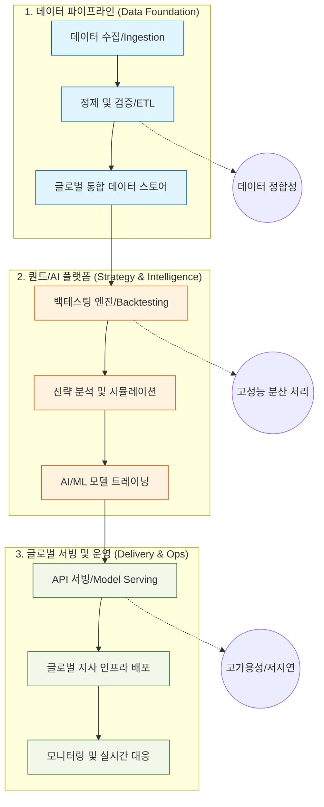

# 02. 직무 로드맵 및 기술 아젠다

미래에셋자산운용 Platform Engineering 팀의 Backend Engineer로서 수행하게 될 업무의 전체적인 흐름과 기술 스택, 그리고 핵심 기술적 도전 과제(Agenda)를 시각화하여 정리했습니다.

## 🗺 직무 프로세스 맵 (Job Process Map)

---

## 🛠 단계별 기술 스택 (Technology Stack)

| 단계 | 주요 활동 | 핵심 기술 |
| :--- | :--- | :--- |
| **Data Pipeline** | 외부 API(금융 데이터), 내부 DB 연동, 대용량 로그 수집 | Python, Pandas, Apache Airflow, Kafka, Spark |
| **Quant Platform** | 벡터화 연산 기반 백테스팅, 성과 지표 산출 | Python, NumPy, C++(성능 병목 최적화), SQL |
| **AI/ML Serving** | 모델 추론 API 개발, 모델 버전 관리 | FastAPI, Flask, BentoML, MLflow |
| **Infra & DevOps** | 글로벌 서비스 배포 및 가용성 확보 | Kubernetes, Docker, Jenkins, Git, Terraform |
| **Monitoring** | 로그 통합 및 장애 실시간 알림 | OpenSearch (ELK), Prometheus, Grafana |

---

## 🚀 핵심 기술적 아젠다 (Technical Agenda)

본 포지션에서 엔지니어로서 해결해야 할 가장 중요한 3가지 도전 과제입니다.

### 1. 데이터의 무결성과 시점 정렬 (Data Integrity & Look-ahead Bias Prevention)
- **과제**: 수만 개의 종목 데이터가 각기 다른 시점에 들어올 때, 이를 오차 없이 정렬하여 백테스팅의 신뢰도를 확보하는 것.
- **해결 방향**: 이벤트 기반 아키텍처 도입 및 엄격한 데이터 검증(Validation) 파이프라인 구축.

### 2. 고성능 분산 백테스팅 엔진 (Scalable Backtesting Engine)
- **과제**: 수백 명의 매니저가 수천 개의 전략을 동시에 시뮬레이션할 때 발생하는 연산 병목 해결.
- **해결 방향**: 연산 로직의 병렬화(Parallelization) 및 C++/Golang을 활용한 핵심 연산 모듈 최적화.

### 3. 글로벌 고가용성 서비스 (Global High Availability)
- **과제**: 서울 본사뿐만 아니라 뉴욕, 런던, 홍콩 등 글로벌 지사에서 지연 시간(Latency) 없이 플랫폼에 접근하도록 하는 것.
- **해결 방향**: Kubernetes 멀티 클러스터 운영 및 글로벌 트래픽 로드밸런싱 최적화.

---

## 📈 단계별 성장 스텝 (Step-by-Step Growth)

1. **Step 1: 플랫폼 이해 및 안정화**
   - 기존 데이터 파이프라인 및 백테스팅 엔진의 구조 분석
   - 로그 시스템(OpenSearch) 및 CI/CD 환경 고도화

2. **Step 2: 성능 최적화 및 기능 확장**
   - 백테스팅 엔진의 병목 지점 개선 (분산 처리 도입)
   - 새로운 퀀트 팩터 및 AI 모델 서빙 기능 추가

3. **Step 3: 아키텍처 설계 및 글로벌 주도**
   - 차세대 글로벌 자산운용 플랫폼 아키텍처 설계
   - AI 기반 자동화 투자 시스템의 핵심 엔진 개발 리딩
