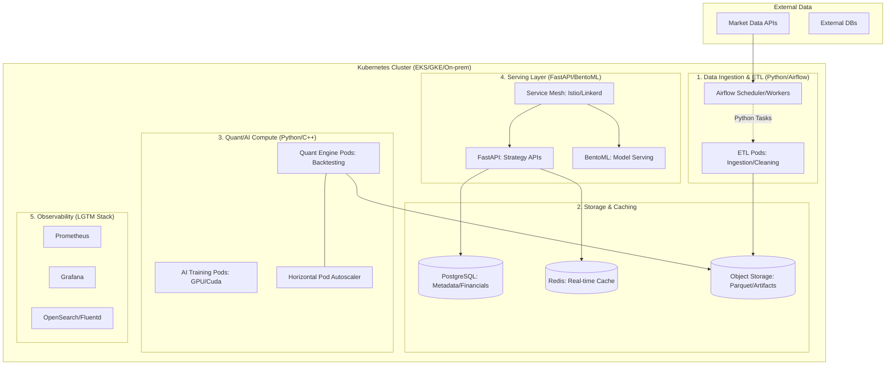

# 03. Python & Kubernetes 기반 시스템 아키텍처

미래에셋자산운용 Platform Engineering 팀에서 구축하게 될 **Python 기반 퀀트/AI 플랫폼의 Kubernetes 아키텍처** 설계안입니다. 

## 🏗 전체 시스템 아키텍처 (System Architecture)

---

## 🐍 Python의 역할 (Role of Python)

1. **데이터 처리 및 분석 (Pandas/NumPy/Polars)**:
   - 금융 시계열 데이터의 벡터화 연산 수행.
   - ETL 파이프라인에서 데이터 정제 및 피처 엔지니어링 리딩.
2. **백엔드 서비스 (FastAPI/Flask)**:
   - 가볍고 빠른 비동기(Async) 프레임워크를 활용하여 퀀트 전략 조회 및 실행 API 구축.
3. **AI/ML 워크플로우 (PyTorch/Scikit-learn)**:
   - 모델 학습, 검증, 시뮬레이션 및 추론 로직 구현.
4. **인프라 자동화 (SDK)**:
   - `kubernetes-python-client` 등을 활용하여 쿠버네티스 리소스 동적 제어.

---

## ☸️ Kubernetes 활용 전략 (Kubernetes Strategy)

### 1. 워크로드 분리 및 관리
- **Job/CronJob**: 주기적인 데이터 수집 및 배치성 백테스팅 연산.
- **Deployment**: 24/7 구동되어야 하는 API 서빙 및 대시보드 백엔드.
- **StatefulSet**: 데이터베이스(PostgreSQL) 및 캐시(Redis)의 안정적인 운영.

### 2. 확장성 및 리소스 최적화 (Scalability)
- **HPA (Horizontal Pod Autoscaler)**: CPU/Memory 사용량 또는 Custom Metric(예: 큐 대기열)에 따른 파드 자동 확장.
- **Resource Quotas/Limits**: 특정 퀀트 모델이 클러스터 전체 자원을 점유하지 못하도록 제한 설정.
- **Node Affinity/Taints**: GPU가 필요한 AI 학습 파드를 특정 노드 그룹에 배치.

### 3. 고가용성 및 무중단 배포 (HA & GitOps)
- **Rolling Update**: 서비스 중단 없이 새로운 전략/모델 배포.
- **ArgoCD (GitOps)**: Git 저장소의 매니페스트와 클러스터 상태를 동기화하여 선언적 인프라 관리.
- **Service Mesh**: 글로벌 지사 간 저지연 통신 및 보안 트래픽 관리.

---

## 🔄 데이터 흐름 (Data Flow)

1. **수집**: Airflow가 Python 스립트를 구동하여 외부 금융 API에서 데이터를 수집.
2. **저장**: 가공된 대용량 데이터는 Parquet 형태로 Object Storage에, 메타데이터는 PostgreSQL에 저장.
3. **연산**: 사용자가 백테스팅 요청 시, Kubernetes가 Quant Engine Pod를 생성하여 분산 연산 수행.
4. **서빙**: 최종 확정된 모델/전략은 FastAPI/BentoML을 통해 전 세계 지사에 API로 제공.

이러한 구조를 통해 **미래에셋자산운용**은 파이썬의 유연한 분석 능력과 쿠버네티스의 강력한 인프라 관리 능력을 결합하여, 글로벌 시장에 대응하는 고성능 자산운용 플랫폼을 운영할 수 있습니다.
