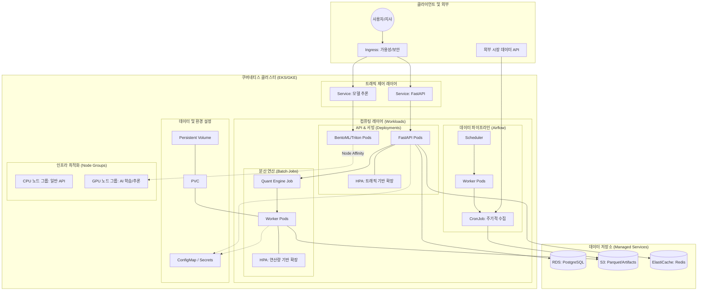

# 03. Python & Kubernetes 기반 시스템 아키텍처

미래에셋자산운용 Platform Engineering 팀에서 구축하게 될 **Python 기반 퀀트/AI 플랫폼의 Kubernetes 아키텍처** 상세 설계안입니다. 

## 🏗 쿠버네티스 상세 아키텍처 (Kubernetes Detailed Architecture)

---

## ☸️ 쿠버네티스 핵심 객체 활용 상세

### 1. 워크로드 타입별 객체 선택 (Controller)
| 워크로드 구분 | 쿠버네티스 객체 | 선정 이유 |
| :--- | :--- | :--- |
| **퀀트/AI 서빙** | `Deployment` | 24/7 가동, 무중단 배포(Rolling Update) 및 자가 치유(Self-healing) 필요 |
| **데이터 수집** | `CronJob` | 특정 시간(장 마감 후 등)에 주기적으로 Python 스크립트 실행 |
| **백테스팅 연산** | `Job` | 요청 시점에 생성되어 연산 완료 후 자원을 반납하는 휘발성 워크로드 |
| **데이터베이스** | `StatefulSet` | 고정된 식별자와 영구 저장소(PV)가 필요한 상태 유지 워크로드 |

### 2. 자동 확장 전략 (Autoscaling)
- **HPA (Horizontal Pod Autoscaler)**: 
  - **API 서빙**: CPU/Memory 부하에 따라 Pod 개수 자동 조절.
  - **퀀트 엔진**: 백테스팅 요청 큐(Queue)의 길이를 Custom Metric으로 받아 워커 Pod 확장.
- **CA (Cluster Autoscaler)**: Pod를 띄울 노드 자원이 부족할 경우 클라우드(AWS/GCP) 인스턴스를 자동으로 추가.

### 3. 고성능 연산 최적화 (Scheduling)
- **Node Affinity**: AI 추론과 같이 GPU가 필요한 Pod를 `nvidia-gpu` 레이블이 붙은 노드에만 배치.
- **Taints & Tolerations**: 고성능 연산 전용 노드에 일반 웹 서버 Pod가 배치되어 자원을 간섭하는 것을 방지.
- **Resources Quotas**: 특정 팀이나 프로젝트가 전체 클러스터 자원을 독점하지 못하도록 네임스페이스별 자원 제한.

### 4. 네트워크 및 보안 (Connectivity)
- **Ingress Controller**: 외부 트래픽의 단일 진입점. SSL 종단 및 경로 기반 라우팅(예: `/v1/quant`, `/v1/ai`) 담당.
- **ConfigMap & Secret**: DB 접속 정보, API 키 등 환경 설정을 코드와 분리하여 주입.
- **Persistent Volume (PV/PVC)**: 대용량 시계열 데이터를 캐싱하거나 연산 중간 결과물을 저장하기 위한 고성능 디스크 연결.

---

## 🔄 상세 데이터 흐름 (Detailed Data Flow)

1. **사용자 요청**: 글로벌 지사에서 Ingress를 통해 백테스팅 요청을 보냄.
2. **오케스트레이션**: FastAPI Pod가 요청을 받아 큐에 적재하고, 필요시 Kubernetes API를 호출하여 `Job` 또는 `Pod`을 동적으로 생성.
3. **연산 실행**: 생성된 Quant Engine Pod는 S3에서 대용량 Parquet 데이터를 읽어와 메모리(Pandas)상에서 벡터화 연산 수행.
4. **결과 서빙**: 연산이 완료되면 결과는 다시 S3에 저장되고, 사용자는 API를 통해 최종 리포트를 확인.
5. **모니터링**: 모든 과정은 Prometheus와 Grafana를 통해 실시간으로 가시화되며, 이상 발생 시 Slack 알람 발송.

이 상세 구조는 **파이썬의 분석 유연성**을 유지하면서도, **금융 플랫폼의 안정성과 확장성**을 쿠버네티스로 해결하는 실무적인 아키텍처입니다.
