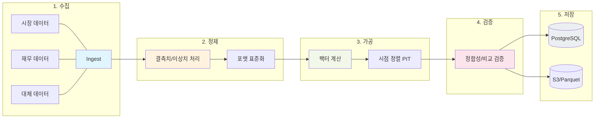

# 05. 데이터 파이프라인(Data Pipeline) 상세 정리

사용자께서 추측하신 내용이 정확합니다. 자산운용사의 데이터 파이프라인은 단순히 데이터를 가져오는 것을 넘어, **"투자 의사결정의 재료가 되는 데이터를 신뢰할 수 있는 상태로 만드는 모든 과정"**을 의미합니다.

## 🔄 데이터 파이프라인 프로세스

## 🔄 데이터 파이프라인 5단계

### 1. 데이터 수집 (Sourcing & Ingestion)
외부의 다양한 소스로부터 로우(Raw) 데이터를 끌어오는 단계입니다.
- **시장 데이터**: 한국거래소(KRX), 블룸버그(Bloomberg), 로이터(Reuters), Yahoo Finance 등에서 API나 FTP를 통해 종가, 시가, 거래량 등을 수집.
- **재무 데이터**: 기업 공시 시스템이나 데이터 벤더로부터 PER, PBR, ROE, 배당 수익률 등 재무 지표 수집.
- **대체 데이터**: 뉴스 기사, SNS 감성 분석, 위성 이미지 등 비정형 데이터 수집.

### 2. 정제 및 전처리 (Cleaning & Preprocessing)
수집된 데이터의 오류를 바로잡고 형식을 통일하는 단계입니다.
- **결측치 처리**: 특정 날짜의 주가가 누락된 경우 전일 종가로 채우거나 해당 종목 제외.
- **이상치 제거**: 데이터 입력 오류로 인한 말도 안 되는 수치(예: PBR 0.0001 등) 필터링.
- **포맷 표준화**: 여러 소스의 날짜 형식(YYYY-MM-DD, DD/MM/YY 등)을 하나로 통일.

### 3. 지표 산출 및 가공 (Refinement & Calculation)
분석에 즉시 사용 가능하도록 2차 데이터를 생성하는 단계입니다.
- **팩터 계산**: 시가, 종가, 재무 데이터를 조합하여 PBR, PER, 모멘텀 지표 등을 계산.
- **시점 정렬(Point-in-Time)**: 백테스팅 시 과거의 특정 시점에서 '알 수 있었던 데이터'만 사용하도록 시점을 엄격하게 맞춤 (Look-ahead bias 방지).
- **수정 주가 계산**: 유상증자, 액면분할 등을 반영하여 연속성 있는 주가 데이터 생성.

### 4. 품질 검증 (Quality Assurance)
데이터의 정확성을 최종적으로 확인하는 단계입니다. (금융 플랫폼에서 가장 중요한 단계)
- **정합성 체크**: "오늘 종가가 어제 종가 대비 ±30% 이상 변동했는가?"와 같은 로직으로 데이터 튀는 현상 감시.
- **비교 검증**: 소스 A와 소스 B의 데이터를 대조하여 차이가 발생하는지 확인.

### 5. 저장 및 서빙 (Storage & Serving)
가공된 데이터를 분석가(매니저)나 시스템(백테스트 엔진)이 쓰기 좋게 배치하는 단계입니다.
- **데이터 웨어하우스/레이크**: 분석용으로 최적화된 Parquet, HDF5 파일 형식이나 PostgreSQL 같은 DB에 저장.
- **Feature Store**: AI 모델 학습에 바로 쓰일 수 있도록 특징(Feature) 단위로 관리.

---

## 💡 면접용 핵심 포인트
면접에서 데이터 파이프라인에 대해 질문을 받으면 아래와 같이 답변하는 것이 좋습니다.

> "네, 제가 이해한 데이터 파이프라인은 외부 API나 벤더로부터 시장 데이터를 수집하여, **투자 전략에 즉시 활용 가능한 '신뢰할 수 있는 데이터'로 만드는 일련의 오케스트레이션 과정**입니다.
> 특히 자산운용사에서는 **Look-ahead bias(미래 참조 편향)**를 방지하기 위한 엄격한 시점 정렬과, 대규모 연산의 효율성을 위한 **벡터화된 데이터 구조(Parquet 등)**를 설계하는 것이 플랫폼 엔지니어의 핵심 역량이라고 생각합니다."

이 정리는 자산운용사 백엔드 엔지니어로서 데이터의 흐름을 완벽히 이해하고 있음을 보여줍니다.
