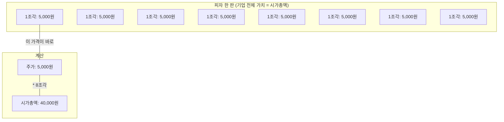
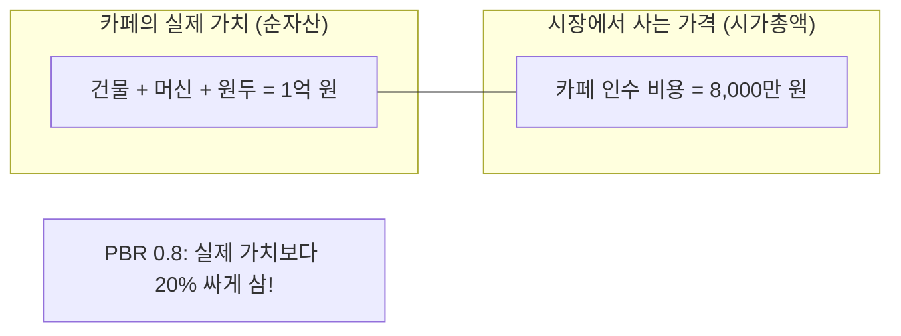
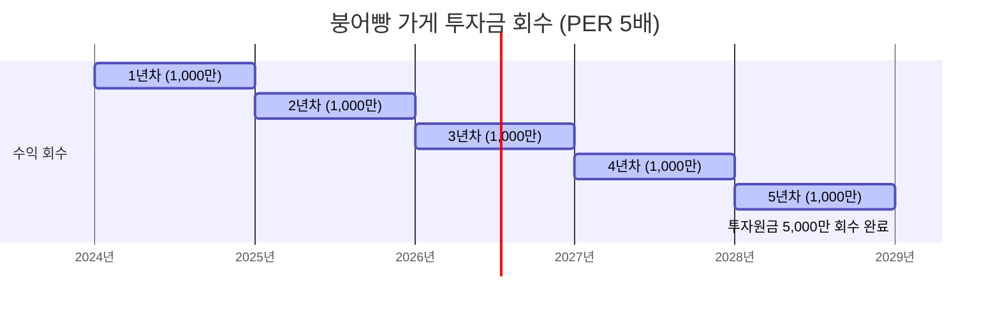
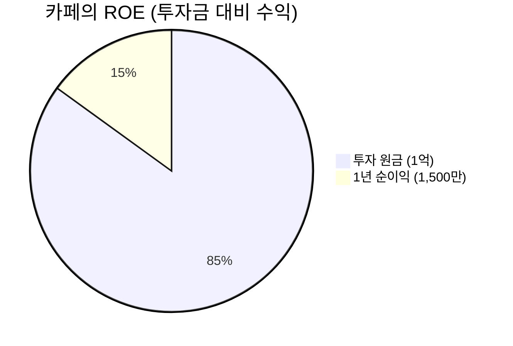
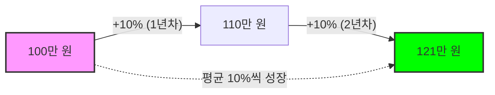
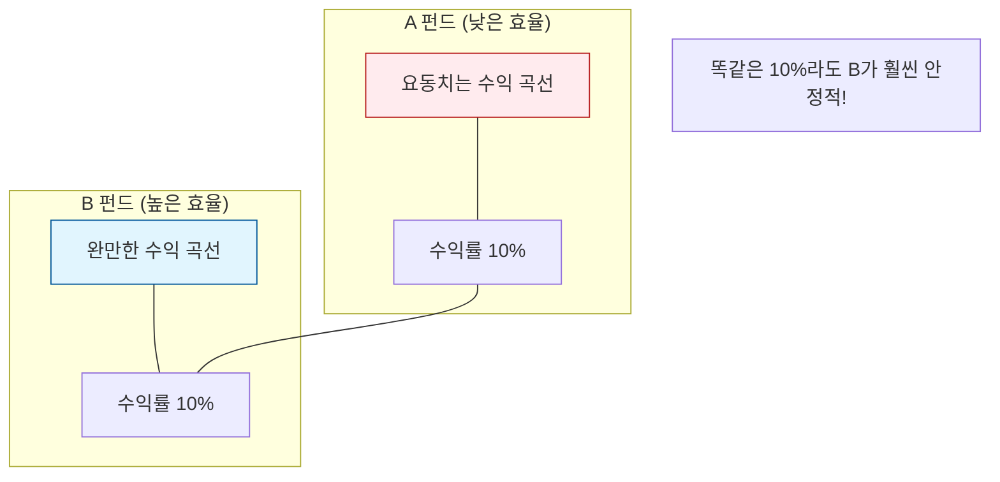

# 07. 핵심 금융 용어 정리 (Financial Terminology)

자산운용사 Backend Engineer로서 시스템을 개발하고 데이터를 다룰 때 반드시 이해해야 하는 핵심 주식 및 금융 용어들을 정리했습니다.

---

## 📈 주식 기본 용어

### 1. 주가 (Stock Price) & 2. 시가총액 (Market Capitalization)
- **주가**: 주식 시장에서 거래되는 주식 1주의 가격입니다.
- **시가총액**: 기업의 전체 가치를 시장 가격으로 나타낸 금액입니다. (`주가 × 발행 주식 총수`)



- **엔지니어링 포인트**: 주가는 단순 수치가 아니라 **수정주가(Adjusted Stock Price)** 개념이 중요합니다. 액면분할, 증자 등으로 인해 주가가 급격히 변할 때 시계열의 연속성을 유지하기 위해 이를 보정한 값을 사용해야 백테스팅 결과가 왜곡되지 않습니다.
- **의미**: 기업의 규모를 판단하는 척도입니다. 퀀트 전략에서 '소형주'를 정의할 때 주로 시가총액 하위 N% 등의 기준을 사용합니다.

### 3. PBR (Price Book-value Ratio, 주가순자산비율)
- **정의**: 주가가 순자산(자본)에 비해 1주당 몇 배에 거래되고 있는지를 나타냅니다.
- **예시**: 어떤 카페의 건물과 기계를 다 팔면 1억 원(순자산)인데, 이 카페를 통째로 인수하려면 8,000만 원(시가총액)만 주면 되는 경우 PBR은 0.8입니다. (자산 가치보다 싸게 거래됨)


- **Book-value의 의미**:
    - 직역하면 **장부 가치**(帳簿 價値)입니다. 여기서 '장부(Book)'는 회계 장부를 의미합니다.
    - 즉, 회계 장부에 기록된 기업의 자산에서 부채를 빼고 남은 **순수한 가치**(순자산)를 뜻합니다.
    - 이론적으로 기업이 지금 당장 사업을 그만두고 모든 재산을 팔아 빚을 갚았을 때, 주주들에게 돌아올 **청산 가치**와 같습니다.
- **계산식**: `주가 / BPS(1주당 순자산)`
- **용어 설명**:
    - **자산(Asset)**: 기업이 보유한 전체 재산 (자본 + 부채)
    - **부채(Liability)**: 타인에게 빌린 돈
    - **순자산(Net Asset/Equity)**: 자산에서 부채를 뺀 금액, 즉 **자본(Capital)**과 같은 의미입니다. 주주들의 몫이기에 '자기자본'이라고도 불립니다.
- **의미**: 
    - **PBR < 1**: 주가가 기업이 가진 순자산 가치보다 낮게 평가됨 (저평가 상태)
    - **PBR > 1**: 주가가 자산 가치보다 높게 평가됨 (성장성 반영 또는 고평가)
- **전략 적용**: 본 프로젝트의 '저PBR 전략'은 자산 가치 대비 싼 주식을 사서 수익을 내는 가치 투자 방식입니다.

---

## 📊 수익성 및 가치 지표

### 4. PER (Price Earnings Ratio, 주가수익비율)
- **정의**: 주가가 1주당 순이익(EPS)의 몇 배인지 나타냅니다.
- **예시**: 어떤 붕어빵 가게가 1년에 1,000만 원을 버는데, 이 가게의 권리금이 5,000만 원이라면 PER은 5배입니다. 즉, 투자 원금을 회수하는 데 5년이 걸린다는 뜻이기도 합니다.



- **의미**: 기업이 벌어들이는 이익에 비해 주가가 적정한지 판단합니다. 보통 PER이 낮으면 이익 대비 주가가 저렴하다고 봅니다.

### 5. ROE (Return On Equity, 자기자본이익률)
- **정의**: 기업이 주주의 돈(자기자본)을 활용해 1년 동안 얼마나 벌었는지를 나타내는 수익성 지표입니다.
- **예시**: 내가 1억 원을 투자해서 카페를 차렸고, 1년 동안 1,500만 원의 순이익을 냈다면 ROE는 15%입니다.



### 6. 배당수익률 (Dividend Yield)
- **정의**: 주가 대비 배당금이 몇 %인지 나타내는 지표입니다.
- **계산식**: `(1주당 배당금 / 주가) × 100`
- **예시**: 1주에 10,000원인 주식을 가졌을 때, 회사가 연말에 500원을 배당금으로 준다면 배당수익률은 5%입니다. 은행 예금 이자와 비교하기 좋은 지표입니다.
- **의미**: 배당주 투자 전략의 핵심 지표입니다.

---

## 🛡 리스크 및 성과 측정 지표 (백테스팅 핵심)

### 7. CAGR (Compound Annual Growth Rate, 연평균 성장률)
- **정의**: 여러 해 동안의 투자 수익률을 매년 일정한 비율로 성장했다고 가정했을 때의 평균 수익률입니다.
- **예시**: 100만 원을 투자해서 1년 뒤에 110만 원(+10%), 그다음 해에 121만 원(+10%)이 되었다면 2년간 CAGR은 10%입니다. (복리의 마법)



- **의미**: 단순 합산 평균이 아닌 '복리' 개념이 적용된 수익률입니다.

### 8. MDD (Maximum Drawdown, 최대 낙폭)
- **정의**: 특정 기간 동안 고점에서 저점까지 떨어진 최대 하락 비율입니다.
- **예시**: 내 계좌 잔고가 최고 2,000만 원까지 갔다가 한때 1,200만 원까지 떨어졌다면, MDD는 -40%입니다.

```mermaid
xychart-beta
    title "MDD 시각화 (최고점 대비 하락폭)"
    x-axis [1월, 2월, 3월(고점), 4월, 5월(저점), 6월]
    y-axis "잔고 (만 원)" 1000 --> 2500
    line [1500, 1700, 2000, 1600, 1200, 1400]
```

- **의미**: 투자자가 겪을 수 있는 **최악의 고통**을 수치화한 것입니다. 수익률이 아무리 좋아도 MDD가 너무 크면 실제 운용 시 심리적으로 견디기 어렵습니다.

### 9. 샤프 지수 (Sharpe Ratio)
- **정의**: 변동성(위험) 대비 수익률이 얼마나 높은지 나타내는 지표입니다.
- **예시**: 두 펀드가 똑같이 10% 수익을 냈더라도, A 펀드는 주가가 요동치며 힘들게 올라갔고 B 펀드는 완만하게 올라갔다면 B 펀드의 샤프 지수가 더 높습니다.



- **의미**: "위험을 한 단위 부담했을 때 얻는 초과 수익"을 의미하며, 지수가 높을수록 위험 관리 대비 수익 효율이 좋은 전략입니다.

---

## 💡 면접용 핵심 요약

> "백엔드 엔지니어로서 데이터를 다룰 때, 단순히 숫자 값으로만 보는 것이 아니라 **수정주가**를 통한 데이터의 연속성 확보, **시점 정렬(Point-in-Time)**을 통한 PBR/PER 지표의 정확한 대입 등 금융 도메인 지식을 바탕으로 데이터의 무결성을 지키는 것이 가장 중요하다고 생각합니다."
