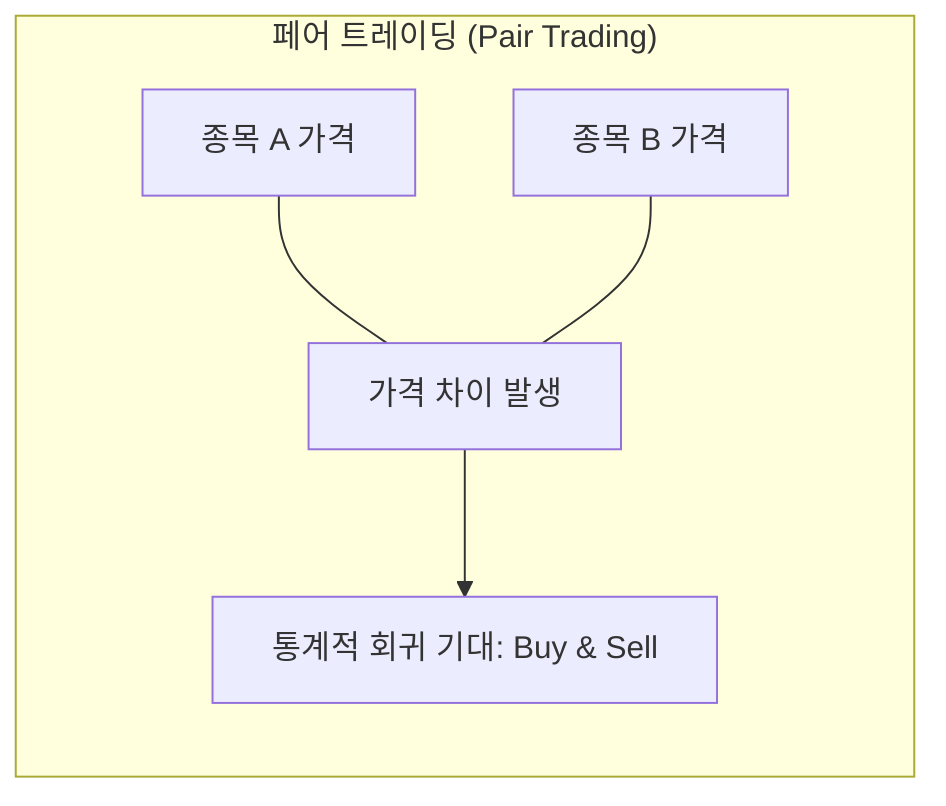
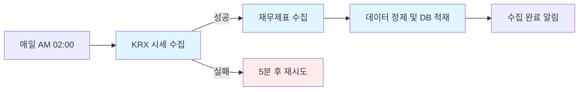
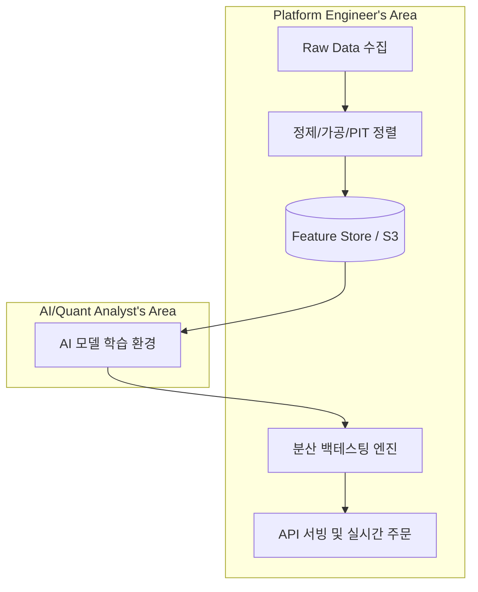
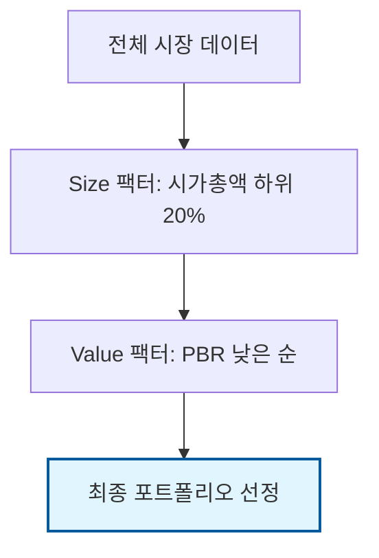

# 08. 대표적인 퀀트 투자 모델 (Quant Investment Models)

퀀트 투자는 수학적, 통계적 모델을 기반으로 투자 결정을 내리는 방식입니다. 자산운용사 백엔드 엔지니어로서 각 모델의 논리와 이를 구현하기 위한 기술적 요구사항을 이해하는 것이 중요합니다.

---

## 🤖 주요 퀀트 투자 모델 분류

### 1. 팩터 모델 (Factor Investing)
- **핵심 개념**: 주식의 수익률을 결정하는 특정 **요소(Factor)**들을 찾아내어 투자하는 방식입니다.
- **주요 팩터**:
    - **가치 (Value)**: 자산 대비 싼 주식을 선택 (**PBR, PER** 활용). *본 프로젝트의 핵심 전략*
    - **모멘텀 (Momentum)**: 최근에 수익률이 좋았던 주식이 계속 오를 것이라 믿고 투자.
    - **소형주 (Size)**: 시가총액이 작은 주식이 대형주보다 장기적으로 높은 수익을 낸다는 현상에 투자.
    - **퀄리티 (Quality)**: 이익이 안정적이고 부채가 적은 우량 기업에 투자 (**ROE, GP/A** 등 활용).
- **엔지니어링 포인트**: 대량의 재무 데이터를 시점 정렬(Point-in-Time)하여 과거 시점의 정확한 팩터 값을 산출하는 것이 핵심입니다.

### 2. 통계적 차익거래 (Statistical Arbitrage)
- **핵심 개념**: 서로 연관성 있는 자산들의 가격 차이가 일시적으로 벌어졌을 때, 다시 좁혀질 것을 기대하고 투자하는 방식입니다.
- **대표 사례: 페어 트레이딩 (Pair Trading)**:
    - **예시**: '삼성전자'와 'SK하이닉스'의 가격 차이(Spread)가 역사적 평균보다 커지면, 비싼 쪽을 팔고(Short) 싼 쪽을 사서(Long) 차이가 좁혀질 때 수익을 챙깁니다.
- **엔지니어링 포인트**: 실시간 가격 데이터(Tick Data)를 빠르게 처리하고, 두 자산 간의 상관관계(Correlation) 및 공적분(Cointegration)을 실시간으로 계산하는 저지연(Low-latency) 시스템이 필요합니다.

### 3. 리스크 패리티 (Risk Parity)
- **핵심 개념**: 자산의 금액 비중이 아니라, 각 자산이 전체 포트폴리오에 기여하는 **위험(변동성)의 비중**을 똑같이 맞추는 모델입니다.
- **예시**: 주식은 변동성이 크고 채권은 작으므로, 위험을 똑같이 배분하기 위해 채권의 투자 비중을 주식보다 훨씬 높게 가져갑니다. (레이 달리오의 **올웨더 포트폴리오**가 대표적)
- **엔지니어링 포인트**: 각 자산의 변동성과 자산 간 상관계수를 정교하게 계산하여 최적의 비중을 산출하는 최적화(Optimization) 알고리즘이 중요합니다.

### 4. 추세 추종 (Trend Following)
- **핵심 개념**: 시장의 방향성이 결정되면 그 방향으로 추세가 지속될 것이라고 가정하고 투자하는 모델입니다.
- **활용**: 이동평균선(Moving Average) 교차 등을 활용하여 상승장에서는 매수, 하락장에서는 매도 또는 숏 포지션을 취합니다. "오르는 말에 올라타는" 전략입니다.
- **엔지니어링 포인트**: 다양한 타임프레임(일봉, 분봉 등)의 이동평균을 실시간으로 계산하고 시그널을 생성하는 파이프라인 구축이 필요합니다.

---

## 📊 전략별 특징 비교

| 모델 | 주요 데이터 | 연산 복잡도 | 매매 빈도 |
| :--- | :--- | :--- | :--- |
| **팩터 모델** | 재무제표, 일별 종가 | 중간 | 월간/연간 |
| **차익거래** | 실시간 호가(Tick) | 높음 | 일간/초단위 |
| **리스크 패리티** | 자산별 수익률/변동성 | 높음 | 분기/연간 |
| **추세 추종** | 주가 시계열 데이터 | 낮음 | 일간/주간 |

---

## 🧠 퀀트 투자와 AI의 연관성

사용자께서 지적하신 대로, 전통적인 퀀트는 **"정해진 공식(Rule-based)"**에 따라 기계적으로 매매하는 과정이 맞습니다. 하지만 현대의 퀀트는 AI(인공지능)와 결합하여 그 한계를 넘어서고 있습니다.

### 1. 퀀트 투자란 무엇인가? (Definition)
- **전통적 퀀트 (Traditional Quant)**: 사람이 가설을 세우고 공식을 만듭니다. (예: "PBR이 낮으면 사자")
- **AI 퀀트 (AI-driven Quant)**: 컴퓨터가 방대한 데이터에서 스스로 패턴을 찾습니다. (예: "수만 개의 지표 중 현재 수익률과 가장 상관관계가 높은 복합 패턴은 이것이다")

### 2. AI와의 구체적인 연관성
- **피처 엔지니어링 (Feature Engineering)**: 수천 개의 재무/시장 지표 중 수익률에 영향을 미치는 핵심 변수를 AI가 스스로 추출합니다.
- **비선형 관계 파악**: 주가와 지표 사이의 복잡하고 비선형적인 관계(사람의 머리로는 이해하기 힘든 복합적인 조건들)를 신경망 모델이 학습합니다.
- **감성 분석 (NLP)**: 뉴스, 리포트, SNS 등 텍스트 데이터를 AI가 분석하여 시장의 '분위기'를 데이터화(Sentiment Score)하고 이를 투자 공식에 넣습니다.
- **강화학습 (Reinforcement Learning)**: 시장 상황에 따라 최적의 매수/매도 시점과 비중을 스스로 학습하여 결정합니다.

---

## 🚀 백테스팅 및 분석 플랫폼 아키텍처 (Platform Architecture)

미래에셋자산운용의 Platform Engineering 팀에서 구축하고자 하는 고성능 플랫폼의 아키텍처 및 핵심 기술에 대한 상세 추측 내용은 아래 별도 문서에서 확인하실 수 있습니다.

*   **[백테스팅 및 분석 플랫폼 아키텍처 상세 보기](./09_platform_architecture_prediction.md)**

---

## ⚙️ 퀀트 AI 플랫폼의 직관적 파이프라인 (Engineering Workflow)

플랫폼 엔지니어의 관점에서 퀀트 AI 서비스가 구축되는 과정은 비유 없이 다음과 같이 5단계의 기술적 파이프라인으로 요약됩니다.

### Step 1. 데이터 수집 (Data Ingestion)
- **대상**: 거래소 시세(OHLCV), 기업 재무제표(PBR, PER 등), 대체 데이터(뉴스, SNS).
- **작업**: 외부 벤더(Bloomberg, Reuters) API 및 공공 데이터(KRX, DART) 연동.
- **핵심**: 데이터 누락 없는 안정적인 수집.
    - **Airflow 활용**: 데이터 파이프라인의 스케줄링, 모니터링, 장애 복구(Retry)를 자동화하는 오픈소스 플랫폼입니다. (DAG 구조 활용)

#### 🛠 Apache Airflow vs Kubernetes Scheduler
많은 분들이 혼동하기 쉬운 **워크플로우 오케스트레이터(Airflow)**와 **리소스 스케줄러(K8s)**의 차이점입니다.

| 비교 항목 | Apache Airflow (Workflow Orchestrator) | Kubernetes Scheduler (Resource Scheduler) |
| :--- | :--- | :--- |
| **관점** | **애플리케이션/데이터 로직** 관점 | **인프라/리소스** 관점 |
| **핵심 역할** | 작업 간의 **의존성(Dependency)** 관리 (A 다음 B) | Pod를 최적의 **노드(Node)**에 배치 (비어있는 배에 짐 싣기) |
| **주요 기능** | 실패 시 재시도(Retry), 알림, 과거 데이터 소급(Backfill) | 자원 가용량 확인, 우선순위 할당, 자가 치유(Self-healing) |
| **비유** | 공장의 **공정 설계자** (순서와 절차 결정) | 공장의 **지입차 배차 요원** (빈 차에 짐 싣기) |

**💡 시너지**: 플랫폼 엔지니어링에서는 Airflow의 각 작업을 **KubernetesExecutor**를 통해 개별 K8s Pod로 띄워 실행합니다. 즉, **"Airflow가 순서를 결정하면, K8s 스케줄러가 그 작업을 수행할 빈 서버를 찾아주는"** 협업 구조입니다.

#### 🛠 Apache Airflow란? (Workflow Orchestrator)
데이터 파이프라인의 **스케줄링 및 모니터링**을 자동화하는 오픈소스 플랫폼입니다.

1.  **DAG (Directed Acyclic Graph)**: 데이터가 흐르는 순서(A 작업 후 B 작업 실행)를 '방향이 있고 순환하지 않는 그래프' 형태로 정의합니다.
2.  **스케줄링**: "매일 새벽 2시(KRX 장 종료 후)에 재무제표 데이터를 수집하라"는 식의 복잡한 실행 조건을 관리합니다.
3.  **장애 복구 (Retry)**: 네트워크 오류 등으로 수집이 실패했을 때, 자동으로 다시 시도하거나 담당자에게 알림을 보냅니다.
4.  **Backfill (과거 데이터 채우기)**: 특정 시점의 데이터가 누락되었을 때, 과거 날짜를 지정하여 파이프라인을 재실행하는 기능이 강력합니다.

### Step 2. 데이터 정제 및 가공 (ETL & PIT)
- **작업**: 결측치 처리(전일 종가 대체 등), **수정주가 계산**(액면분할 등 반영), **시점 정렬(Point-in-Time)**.
- **핵심**: AI 모델이 과거 학습 시 미래 데이터를 참조하는 오류(Look-ahead bias)를 물리적으로 차단하도록 데이터 마트를 설계.

### Step 3. AI 모델 학습 및 팩터 산출 (Training)
- **작업**: 정제된 데이터를 바탕으로 AI가 수익률에 기여하는 변수(Feature)를 학습하고 모델 생성.
- **역할**: 플랫폼 엔지니어는 AI 엔지니어가 대량의 데이터를 GPU 서버에서 빠르게 읽을 수 있도록 고성능 스토리지(Parquet/S3) 환경을 제공.

#### 💡 Apache Parquet이란? (Columnar Storage)
- **개념**: 데이터를 행(Row) 단위가 아닌 **열(Column) 단위**로 묶어서 저장하는 고성능 파일 포맷입니다.

#### 🏗️ 행 기반(Row-based) vs 열 기반(Columnar) 저장 방식 비교
- **행 기반 (예: CSV, RDBMS)**: 
    - 저장 방식: `[1번 종목(이름, 날짜, 종가, PBR)], [2번 종목(이름, 날짜, 종가, PBR)]...`
    - 특징: 한 종목의 모든 데이터를 한꺼번에 읽을 때는 빠르지만, 특정 지표만 뽑아낼 때는 불필요한 데이터까지 다 읽어야 합니다.
- **열 기반 (예: Parquet)**: 
    - 저장 방식: `[모든 종목의 이름들...], [모든 종목의 날짜들...], [모든 종목의 PBR들...]`
    - 특징: **특정 열(PBR)만 골라서 읽는 것이 물리적으로 가능**합니다.

#### 🚀 왜 퀀트에서 '열 기반' 저장 방식이 유리한가요?
1. **I/O 효율성 (Selective Read)**: 2,000개 종목의 10년 치 데이터 중 'PBR' 하나만 분석하고 싶을 때, 행 기반(CSV)은 파일 전체를 메모리에 올려야 하지만, Parquet은 PBR 데이터가 모여있는 물리적 구역만 읽으면 됩니다. (속도 수십 배 향상)
2. **높은 압축률 (Better Compression)**: 같은 열에는 동일한 데이터 타입(예: 모두 실수형 가격 데이터)이 모여 있습니다. 비슷한 데이터끼리 모여 있으면 압축 효율이 극대화되어 저장 공간을 획기적으로 줄입니다.
3. **데이터 무결성 (Schema Preservation)**: 파일 내부에 데이터 타입 정보가 포함되어 있어, 별도의 타입 변환 과정 없이 연산에 즉시 활용 가능합니다.

### Step 4. 분산 백테스팅 (Distributed Backtesting)
- **작업**: 생성된 모델(전략)을 과거 10~20년 데이터에 대입하여 가상 시뮬레이션 수행.
- **핵심**: 단일 서버가 아닌 **분산 연산(Spark, Ray 등)**을 통해 수만 개의 전략 조합을 수분 내에 검증하는 연산 인프라 구축.

### Step 5. 모델 서빙 및 실시간 모니터링 (Serving & Ops)
- **작업**: 검증된 모델을 API 형태로 배포(Serving)하고, 실시간 시세 데이터와 결합하여 매수/매도 시그널 생성.
- **핵심**: 주문 시스템 연동 시의 지연 시간(Latency) 최소화 및 장애 감지 모니터링 구축.

---

## 📊 플랫폼 엔지니어의 핵심 역할 (Summary)

### 💡 면접용 핵심 요약

> "제가 이해한 자산운용 플랫폼 엔지니어의 역할은 **'데이터의 무결성'**과 **'연산의 효율성'**을 책임지는 것입니다. 
> 1. 수집 단계부터 **시점 정렬(PIT)**을 엄격히 적용하여 AI 모델의 왜곡을 방지하고, 
> 2. 수백만 건의 시뮬레이션을 **분산 처리**하여 분석 속도를 극대화하며, 
> 3. 최종적으로 모델이 시장 상황에 맞게 안정적으로 **API 서빙**되도록 인프라를 구축하는 것이 제 직무의 핵심입니다."

---

## 💡 프로젝트와의 연관성

본 프로젝트에서 구현한 **"소형주 저PBR 전략"**은 팩터 모델 중 **가치(Value) 팩터**와 **사이즈(Size) 팩터**를 결합한 멀티 팩터 전략입니다.

---

## 💡 면접용 핵심 요약

> "저는 단순히 코드를 짜는 엔지니어를 넘어, **팩터 모델의 데이터 정합성**이나 **통계적 차익거래의 실시간성** 등 각 투자 모델이 요구하는 기술적 핵심 요소를 이해하고 있습니다. 특히 우리 프로젝트에서 다룬 팩터 모델은 시점 정렬이 틀어질 경우 'Look-ahead bias'가 발생하여 결과가 왜곡될 수 있다는 점을 인지하고, 데이터 무결성 확보에 집중했습니다."
