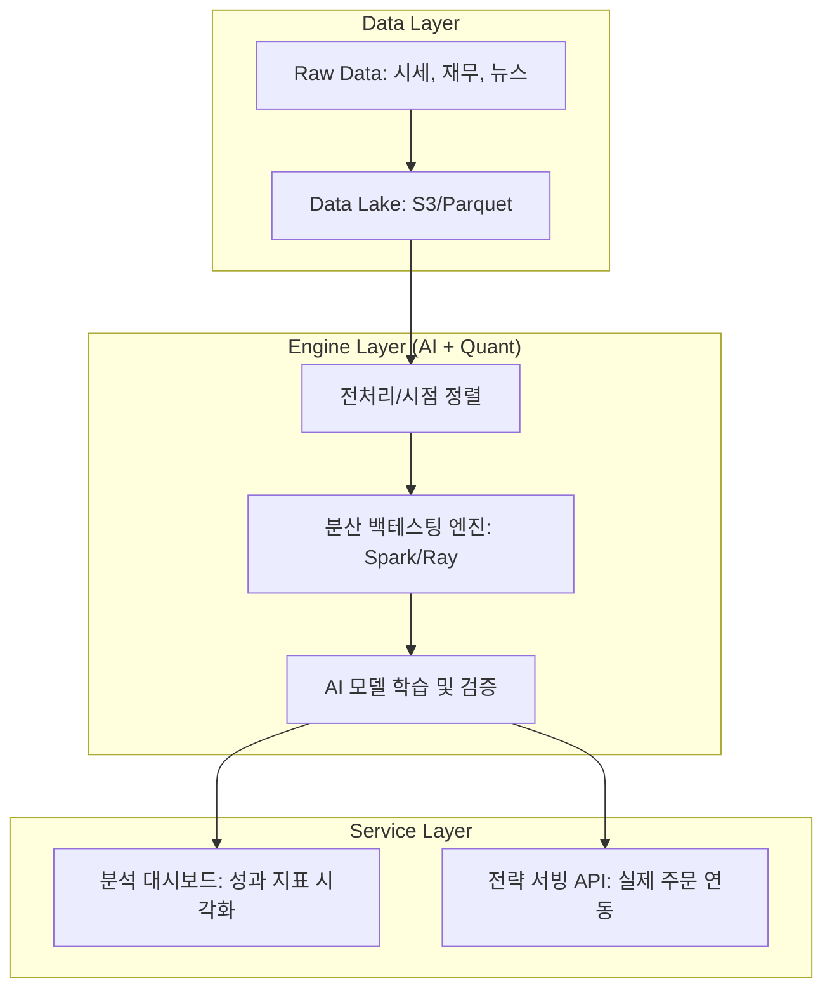

# 08. 대표적인 퀀트 투자 모델 (Quant Investment Models)

퀀트 투자는 수학적, 통계적 모델을 기반으로 투자 결정을 내리는 방식입니다. 자산운용사 백엔드 엔지니어로서 각 모델의 논리와 이를 구현하기 위한 기술적 요구사항을 이해하는 것이 중요합니다.

---

## 🤖 주요 퀀트 투자 모델 분류

### 1. 팩터 모델 (Factor Investing)
- **핵심 개념**: 주식의 수익률을 결정하는 특정 **요소(Factor)**들을 찾아내어 투자하는 방식입니다.
- **주요 팩터**:
    - **가치 (Value)**: 자산 대비 싼 주식을 선택 (**PBR, PER** 활용). *본 프로젝트의 핵심 전략*
    - **모멘텀 (Momentum)**: 최근에 수익률이 좋았던 주식이 계속 오를 것이라 믿고 투자.
    - **소형주 (Size)**: 시가총액이 작은 주식이 대형주보다 장기적으로 높은 수익을 낸다는 현상에 투자.
    - **퀄리티 (Quality)**: 이익이 안정적이고 부채가 적은 우량 기업에 투자 (**ROE, GP/A** 등 활용).
- **엔지니어링 포인트**: 대량의 재무 데이터를 시점 정렬(Point-in-Time)하여 과거 시점의 정확한 팩터 값을 산출하는 것이 핵심입니다.

### 2. 통계적 차익거래 (Statistical Arbitrage)
- **핵심 개념**: 서로 연관성 있는 자산들의 가격 차이가 일시적으로 벌어졌을 때, 다시 좁혀질 것을 기대하고 투자하는 방식입니다.
- **대표 사례: 페어 트레이딩 (Pair Trading)**:
    - **예시**: '삼성전자'와 'SK하이닉스'의 가격 차이(Spread)가 역사적 평균보다 커지면, 비싼 쪽을 팔고(Short) 싼 쪽을 사서(Long) 차이가 좁혀질 때 수익을 챙깁니다.
- **엔지니어링 포인트**: 실시간 가격 데이터(Tick Data)를 빠르게 처리하고, 두 자산 간의 상관관계(Correlation) 및 공적분(Cointegration)을 실시간으로 계산하는 저지연(Low-latency) 시스템이 필요합니다.

### 3. 리스크 패리티 (Risk Parity)
- **핵심 개념**: 자산의 금액 비중이 아니라, 각 자산이 전체 포트폴리오에 기여하는 **위험(변동성)의 비중**을 똑같이 맞추는 모델입니다.
- **예시**: 주식은 변동성이 크고 채권은 작으므로, 위험을 똑같이 배분하기 위해 채권의 투자 비중을 주식보다 훨씬 높게 가져갑니다. (레이 달리오의 **올웨더 포트폴리오**가 대표적)
- **엔지니어링 포인트**: 각 자산의 변동성과 자산 간 상관계수를 정교하게 계산하여 최적의 비중을 산출하는 최적화(Optimization) 알고리즘이 중요합니다.

### 4. 추세 추종 (Trend Following)
- **핵심 개념**: 시장의 방향성이 결정되면 그 방향으로 추세가 지속될 것이라고 가정하고 투자하는 모델입니다.
- **활용**: 이동평균선(Moving Average) 교차 등을 활용하여 상승장에서는 매수, 하락장에서는 매도 또는 숏 포지션을 취합니다. "오르는 말에 올라타는" 전략입니다.
- **엔지니어링 포인트**: 다양한 타임프레임(일봉, 분봉 등)의 이동평균을 실시간으로 계산하고 시그널을 생성하는 파이프라인 구축이 필요합니다.

---

## 📊 전략별 특징 비교

| 모델 | 주요 데이터 | 연산 복잡도 | 매매 빈도 |
| :--- | :--- | :--- | :--- |
| **팩터 모델** | 재무제표, 일별 종가 | 중간 | 월간/연간 |
| **차익거래** | 실시간 호가(Tick) | 높음 | 일간/초단위 |
| **리스크 패리티** | 자산별 수익률/변동성 | 높음 | 분기/연간 |
| **추세 추종** | 주가 시계열 데이터 | 낮음 | 일간/주간 |

---

## 🧠 퀀트 투자와 AI의 연관성

사용자께서 지적하신 대로, 전통적인 퀀트는 **"정해진 공식(Rule-based)"**에 따라 기계적으로 매매하는 과정이 맞습니다. 하지만 현대의 퀀트는 AI(인공지능)와 결합하여 그 한계를 넘어서고 있습니다.

### 1. 퀀트 투자란 무엇인가? (Definition)
- **전통적 퀀트 (Traditional Quant)**: 사람이 가설을 세우고 공식을 만듭니다. (예: "PBR이 낮으면 사자")
- **AI 퀀트 (AI-driven Quant)**: 컴퓨터가 방대한 데이터에서 스스로 패턴을 찾습니다. (예: "수만 개의 지표 중 현재 수익률과 가장 상관관계가 높은 복합 패턴은 이것이다")

### 2. AI와의 구체적인 연관성
- **피처 엔지니어링 (Feature Engineering)**: 수천 개의 재무/시장 지표 중 수익률에 영향을 미치는 핵심 변수를 AI가 스스로 추출합니다.
- **비선형 관계 파악**: 주가와 지표 사이의 복잡하고 비선형적인 관계(사람의 머리로는 이해하기 힘든 복합적인 조건들)를 신경망 모델이 학습합니다.
- **감성 분석 (NLP)**: 뉴스, 리포트, SNS 등 텍스트 데이터를 AI가 분석하여 시장의 '분위기'를 데이터화(Sentiment Score)하고 이를 투자 공식에 넣습니다.
- **강화학습 (Reinforcement Learning)**: 시장 상황에 따라 최적의 매수/매도 시점과 비중을 스스로 학습하여 결정합니다.

---

## 🚀 백테스팅 & 분석 플랫폼 추측 (Future Platform)

미래에셋자산운용의 Platform Engineering 팀에서 구축하고자 하는 플랫폼은 다음과 같은 모습일 것으로 추측됩니다.

### 1. 플랫폼 아키텍처 추측

### 2. 플랫폼의 핵심 기능
- **고성능 분산 연산**: 수만 개의 전략과 AI 하이퍼파라미터 조합을 Kubernetes 클러스터에서 동시에 시뮬레이션합니다.
- **시점 정렬 데이터 서빙**: AI 모델이 '미래 데이터'를 미리 학습하는 오류(Data Leakage)를 원천 차단하는 데이터 파이프라인.
- **통합 분석 도구**: 단순 수익률뿐만 아니라 AI 모델의 판단 근거(XAI, 설명 가능한 AI)를 퀀트 매니저에게 시각적으로 제공합니다.

---

## 💡 프로젝트와의 연관성

본 프로젝트에서 구현한 **"소형주 저PBR 전략"**은 팩터 모델 중 **가치(Value) 팩터**와 **사이즈(Size) 팩터**를 결합한 멀티 팩터 전략입니다.

---

## 💡 면접용 핵심 요약

> "저는 단순히 코드를 짜는 엔지니어를 넘어, **팩터 모델의 데이터 정합성**이나 **통계적 차익거래의 실시간성** 등 각 투자 모델이 요구하는 기술적 핵심 요소를 이해하고 있습니다. 특히 우리 프로젝트에서 다룬 팩터 모델은 시점 정렬이 틀어질 경우 'Look-ahead bias'가 발생하여 결과가 왜곡될 수 있다는 점을 인지하고, 데이터 무결성 확보에 집중했습니다."
