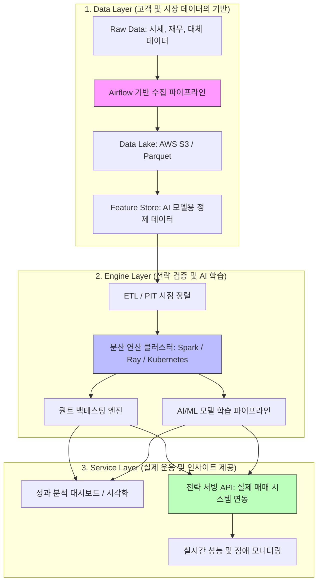
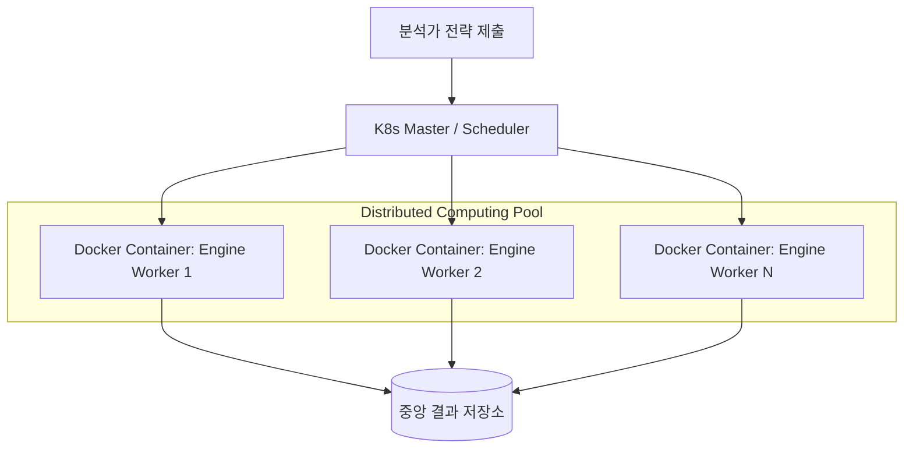
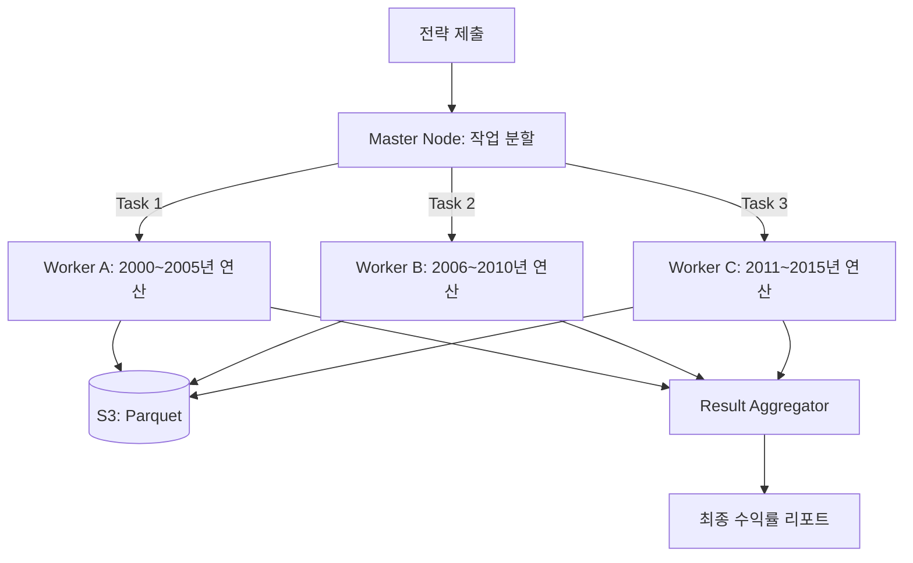

# 09. 백테스팅 및 분석 플랫폼 아키텍처 추측 (Platform Architecture Prediction)

미래에셋자산운용의 Platform Engineering 팀에서 구축하고자 하는 플랫폼은 글로벌 자산운용의 효율성을 극대화하기 위해 최첨단 기술 스택이 집약된 형태일 것으로 추측됩니다.

---

## 🏗 플랫폼 아키텍처 상세 (Architecture Deep Dive)

자산운용 플랫폼은 방대한 양의 시계열 데이터를 처리하고, 복잡한 퀀트 알고리즘과 AI 모델을 안정적으로 구동하기 위해 다음과 같은 계층 구조를 가질 것으로 보입니다.



---

## 🛠 계층별 기술적 상세 (Technical Details)

### 1. Data Layer: 신뢰할 수 있는 데이터의 원천
*   **시점 정렬(Point-in-Time) 데이터 마트**: 퀀트 백테스팅에서 가장 치명적인 오류인 '미래 참조 편향(Look-ahead Bias)'을 방지하기 위해, 특정 과거 시점에 실제로 존재했던 데이터만을 조회할 수 있는 특수한 데이터 구조를 운영합니다.
*   **Parquet 포맷 활용**: 대규모 시계열 데이터를 컬럼 기반 저장 방식인 Parquet으로 관리하여, 특정 팩터(예: PBR) 조회 시 I/O 성능을 극대화합니다.

#### 📝 Python 실전 예시 (데이터 수집 및 정제)
```python
# DataPipeline: 외부 API와 로컬 DB를 연결하는 인터페이스
def fetch_market_data(self):
    # KRX 전체 종목 리스트 및 시가총액(Marcap) 수집
    df = fdr.StockListing('KRX')
    return df

def load_historical_financials(self, path):
    # 백테스팅을 위한 과거 재무 지표(PBR, PER 등) 벌크 로드
    df = pd.read_csv(path)
    return df
```

### 2. Engine Layer: 압도적인 연산 퍼포먼스
*   **분산 컴퓨팅 (Spark/Ray)**: 단일 서버로는 처리가 불가능한 수만 개의 종목-날짜 조합 시뮬레이션을 수백 개의 노드에 분산하여 수 분 내에 완료합니다.
*   **Kubernetes (K8s) 오케스트레이션**: 백테스팅 엔진과 AI 학습 워크로드를 컨테이너화하여 자원을 유연하게 할당하고 고가용성을 보장합니다.

#### 📝 Python 실전 예시 (전략 로직 및 백테스팅)
```python
# QuantStrategy: 소형주 + 저PBR 시그널 생성 (벡터화 연산)
market_cap_limit = df.groupby("year")['시가총액'].transform(lambda x: x.quantile(0.2))
signal_df = selected.pivot(index='year', columns='Name', values='PBR').notna()

# BacktestEngine: shift(-1)을 통한 미래 참조 편향 제거 및 수익률 계산
returns_df = self.price_df.pct_change().shift(-1)
portfolio_returns = (returns_df * self.signal_df.astype(int)).mean(axis=1)
```

### 3. Service Layer: 전략의 실제 적용 및 피드백
*   **설명 가능한 AI (XAI)**: AI 모델이 왜 특정 종목을 매수하라고 결정했는지 그 근거를 분석가들에게 시각적으로 제공하여 의사결정의 투명성을 확보합니다.
*   **전략 서빙 API**: 검증이 완료된 전략을 실시간 매매 시스템과 연동할 때, 지연 시간(Latency)을 최소화하기 위해 고성능 백엔드 프레임워크(Go, Java Spring Boot 등)를 활용합니다.

---

## 🐳 분산 처리 환경에서의 도커(Docker)와 쿠버네티스(K8s)

수만 건의 전략 시뮬레이션을 분산 처리할 때, 도커(Docker)는 단순히 '포장'하는 도구를 넘어 **연산의 일관성과 확장성**을 보장하는 핵심 인프라 역할을 합니다.

### 1. 도커(Docker)의 작동 원리 (분산 환경)
*   **환경의 표준화 (Immutable Infrastructure)**: 
    - 퀀트 엔진이 사용하는 `Pandas`, `NumPy`, `SciPy` 등의 라이브러리 버전이 각 연산 노드마다 다르면 결과가 왜곡될 수 있습니다. 
    - 도커 이미지 안에 모든 의존성을 박제하여, **"내 컴퓨터에서 돌아가면 서버에서도 똑같이 돌아간다"**는 무결성을 보장합니다.
*   **격리된 연산 환경**: 
    - 수백 명의 분석가가 동시에 백테스팅을 돌릴 때, 한 사람의 무거운 연산이 다른 사람의 프로세스에 영향을 주지 않도록 CPU와 메모리 자원을 물리적으로 격리합니다.

### 2. 쿠버네티스(K8s)와의 시너지
*   **자동 스케일링 (Auto-scaling)**: 
    - 백테스팅 요청이 몰리는 시간에는 수백 개의 도커 컨테이너(Worker)를 순식간에 띄워 연산을 처리하고, 작업이 끝나면 즉시 반납하여 클라우드 비용을 최적화합니다.
*   **Self-healing (자가 치유)**: 
    - 분산 연산 중 특정 노드에 장애가 발생하여 도커 컨테이너가 죽더라도, 쿠버네티스가 이를 감지하고 다른 노드에 즉시 재배치하여 연산의 연속성을 유지합니다.



---

## ⛓️ 분산 처리의 필요성과 작동 흐름 (Distributed Processing)

퀀트 AI 플랫폼에서는 데이터의 양이 기하급수적으로 늘어나기 때문에 **데이터 수집, 가공, 연산** 전 과정에서 분산 처리가 필수적입니다.

### 1. 단계별 분산 처리의 필요성

| 단계 | 분산 처리가 필요한 이유 | 핵심 기술 |
| :--- | :--- | :--- |
| **데이터 수집** | 수천 개의 종목 시세를 각각 API로 호출할 때, 순차적(Sequential) 처리는 너무 느림. | `Multi-threading`, `Async IO` |
| **데이터 가공** | 10년 치 전체 종목의 수정주가 계산, 팩터 산출 등 대규모 행렬 연산 시 단일 CPU 메모리 한계. | `Spark`, `Dask`, `Pandas Vectorization` |
| **전략 연산** | 수만 개의 변수 조합(Grid Search)을 테스트하는 백테스팅은 독립적인 연산이므로 병렬화 효과 극대화. | `Ray`, `Kubernetes Job`, `Celery` |

---

### 2. 코드로 보는 분산 처리 예시 (Python)

#### ❌ 순차 처리 (Sequential) - 매우 느림
```python
# 하나씩 순서대로 수집 (1000개 종목 수집 시 1000초 소요 가정)
results = []
for symbol in symbols:
    data = fetch_api(symbol) 
    results.append(data)
```

#### ✅ 분산/병렬 처리 (Parallel/Distributed) - 압도적 속도
```python
# 1. 데이터 수집: 멀티 프로세싱 활용 (CPU 코어만큼 병렬 처리)
from multiprocessing import Pool

with Pool(processes=8) as pool:
    results = pool.map(fetch_api, symbols)

# 2. 대규모 연산: PySpark 활용 (여러 대의 서버에 작업 분산)
from pyspark.sql import SparkSession

spark = SparkSession.builder.appName("QuantAnalysis").getOrCreate()
df = spark.read.parquet("s3://quant-data/raw_prices/")

# 분산 환경에서 그룹화 및 이동평균 계산
from pyspark.sql.window import Window
import pyspark.sql.functions as F

window_spec = Window.partitionBy("symbol").orderBy("date")
df = df.withColumn("MA20", F.avg("close").over(window_spec))
```

---

### 3. 분산 처리 시 작동 흐름 (Master-Worker Architecture)

플랫폼 내부에서는 다음과 같은 흐름으로 분산 처리가 일어납니다.

1.  **Job 제출 (Master)**: 사용자가 "전체 종목 백테스팅" 작업을 제출하면, 마스터 노드가 전체 작업을 작은 단위(Task)로 쪼갭니다.
2.  **자원 할당 (Scheduler)**: 쿠버네티스나 Spark 스케줄러가 현재 비어있는 워커 노드(Worker Node)들에게 작업을 배분합니다.
3.  **데이터 분산 (Sharding/Partitioning)**: 전체 데이터를 연도별 또는 종목별로 파티셔닝하여 각 워커가 담당할 데이터만 메모리에 올리게 합니다.
4.  **병렬 실행 (Execution)**: 각 워커는 독립적으로 자신의 데이터를 처리(계산)합니다.
5.  **결과 취합 (Reduce/Aggregate)**: 모든 워커의 연산이 끝나면 마스터 노드가 결과물을 다시 하나로 합쳐 사용자에게 최종 리포트를 전달합니다.

#### 🛠 Celery vs Kubernetes
분산 처리를 구현할 때 자주 언급되는 두 기술의 역할 차이입니다.

| 비교 항목 | Celery (Distributed Task Queue) | Kubernetes (Container Orchestrator) |
| :--- | :--- | :--- |
| **계층** | **애플리케이션** 레벨 | **인프라/시스템** 레벨 |
| **핵심 목적** | 비동기 작업의 **분배와 순서** 관리 | 컨테이너의 **생명주기와 자원** 관리 |
| **필수 요소** | Broker (Redis, RabbitMQ 등) 필요 | Cluster (Master, Node) 구성 필요 |
| **금융 활용** | 백테스팅 파라미터 분배, 알림 발송 | 분석 엔진 배포, 오토스케일링 |

**💡 작동 프로세스 (How it Works)**: 
사용자가 이해하신 흐름을 기술적으로 더 구체화하면 다음과 같습니다.

1.  **Task 적재**: Celery Client(API 서버 등)가 Task 1, 2, 3을 **Broker(Redis/RabbitMQ)**라는 바구니에 던집니다.
2.  **Worker 대기**: 쿠버네티스에 배포된 **Pod(Celery Worker)**들은 브로커 바구니만 쳐다보고 있습니다.
3.  **Task 분배**: 브로커가 대기 중인 워커 Pod들에게 작업을 하나씩 배달합니다. (K8s가 직접 작업을 나누는 게 아니라 브로커가 나눕니다!)
4.  **자원 관리**: 만약 작업이 너무 많아 브로커에 Task가 쌓이면, **쿠버네티스(HPA)**가 상황을 보고 워커 Pod의 개수를 늘려서 처리 속도를 높입니다.

**💡 시너지**: 플랫폼 엔지니어링에서는 **"쿠버네티스라는 운동장 위에 Celery라는 선수들이 뛰는 구조"**를 즐겨 씁니다. Celery 워커들을 도커 컨테이너로 만들어 쿠버네티스 Pod로 띄우면, 작업량에 따라 워커의 개수를 쿠버네티스가 자동으로 늘려주는(HPA) 환상적인 조합이 완성됩니다.



---

## 🎯 플랫폼의 핵심 가치 (Core Value)

1.  **데이터 무결성 (Data Integrity)**: 엄격한 정제와 PIT 정렬을 통해 전략의 신뢰도를 보장합니다.
2.  **확장성 (Scalability)**: 글로벌 전 지사에서 발생하는 방대한 데이터를 막힘없이 처리합니다.
3.  **안정성 (Reliability)**: 24시간 돌아가는 글로벌 시장에서 장애 없는 서비스 운영을 지향합니다.

---

## 💡 면접용 핵심 요약

> "제가 생각하는 플랫폼 엔지니어의 역할은 퀀트 매니저나 AI 연구원들이 **'기술적 장벽 없이 오직 전략 수립에만 집중할 수 있는 환경'**을 만드는 것입니다. 
> 데이터 레이어에서는 **시점 정렬**을 통해 편향을 제거하고, 엔진 레이어에서는 **분산 연산**을 통해 검증 속도를 높이며, 서비스 레이어에서는 **안정적인 API 서빙**을 통해 전략을 실제 수익으로 연결하는 파이프라인을 구축하는 것이 핵심이라고 생각합니다."
