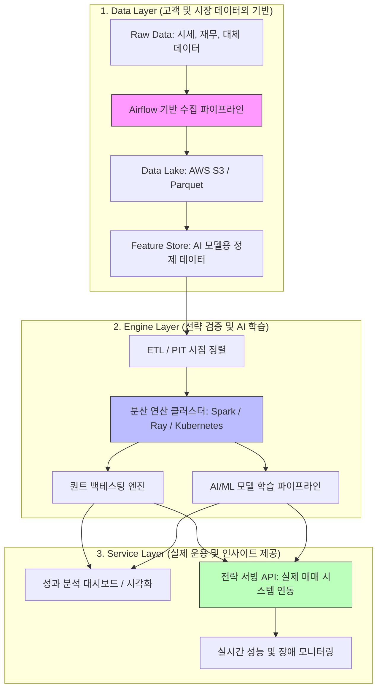

# 09. 백테스팅 및 분석 플랫폼 아키텍처 추측 (Platform Architecture Prediction)

미래에셋자산운용의 Platform Engineering 팀에서 구축하고자 하는 플랫폼은 글로벌 자산운용의 효율성을 극대화하기 위해 최첨단 기술 스택이 집약된 형태일 것으로 추측됩니다.

---

## 🏗 플랫폼 아키텍처 상세 (Architecture Deep Dive)

자산운용 플랫폼은 방대한 양의 시계열 데이터를 처리하고, 복잡한 퀀트 알고리즘과 AI 모델을 안정적으로 구동하기 위해 다음과 같은 계층 구조를 가질 것으로 보입니다.

---

## 🛠 계층별 기술적 상세 (Technical Details)

### 1. Data Layer: 신뢰할 수 있는 데이터의 원천
*   **시점 정렬(Point-in-Time) 데이터 마트**: 퀀트 백테스팅에서 가장 치명적인 오류인 '미래 참조 편향(Look-ahead Bias)'을 방지하기 위해, 특정 과거 시점에 실제로 존재했던 데이터만을 조회할 수 있는 특수한 데이터 구조를 운영합니다.
*   **Parquet 포맷 활용**: 대규모 시계열 데이터를 컬럼 기반 저장 방식인 Parquet으로 관리하여, 특정 팩터(예: PBR) 조회 시 I/O 성능을 극대화합니다.

### 2. Engine Layer: 압도적인 연산 퍼포먼스
*   **분산 컴퓨팅 (Spark/Ray)**: 단일 서버로는 처리가 불가능한 수만 개의 종목-날짜 조합 시뮬레이션을 수백 개의 노드에 분산하여 수 분 내에 완료합니다.
*   **Kubernetes (K8s) 오케스트레이션**: 백테스팅 엔진과 AI 학습 워크로드를 컨테이너화하여 자원을 유연하게 할당하고 고가용성을 보장합니다.

### 3. Service Layer: 전략의 실제 적용 및 피드백
*   **설명 가능한 AI (XAI)**: AI 모델이 왜 특정 종목을 매수하라고 결정했는지 그 근거를 분석가들에게 시각적으로 제공하여 의사결정의 투명성을 확보합니다.
*   **전략 서빙 API**: 검증이 완료된 전략을 실시간 매매 시스템과 연동할 때, 지연 시간(Latency)을 최소화하기 위해 고성능 백엔드 프레임워크(Go, Java Spring Boot 등)를 활용합니다.

---

## 🎯 플랫폼의 핵심 가치 (Core Value)

1.  **데이터 무결성 (Data Integrity)**: 엄격한 정제와 PIT 정렬을 통해 전략의 신뢰도를 보장합니다.
2.  **확장성 (Scalability)**: 글로벌 전 지사에서 발생하는 방대한 데이터를 막힘없이 처리합니다.
3.  **안정성 (Reliability)**: 24시간 돌아가는 글로벌 시장에서 장애 없는 서비스 운영을 지향합니다.

---

## 💡 면접용 핵심 요약

> "제가 생각하는 플랫폼 엔지니어의 역할은 퀀트 매니저나 AI 연구원들이 **'기술적 장벽 없이 오직 전략 수립에만 집중할 수 있는 환경'**을 만드는 것입니다. 
> 데이터 레이어에서는 **시점 정렬**을 통해 편향을 제거하고, 엔진 레이어에서는 **분산 연산**을 통해 검증 속도를 높이며, 서비스 레이어에서는 **안정적인 API 서빙**을 통해 전략을 실제 수익으로 연결하는 파이프라인을 구축하는 것이 핵심이라고 생각합니다."
