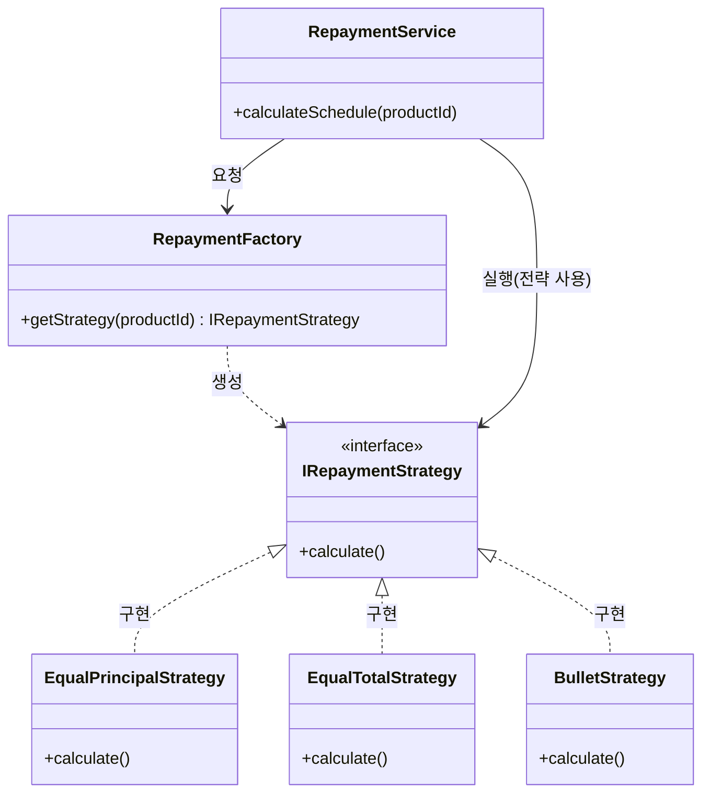

# 07. 디자인 패턴 적용: 스트래티지(Strategy) & 팩토리(Factory) 패턴

사용자가 블로그 포스팅에서 다룬 **"스트래티지·팩토리 패턴을 활용한 상환 스케줄 계산 로직 개선"** 사례를 면접에서 강력한 기술적 성과로 활용할 수 있도록 정리했습니다.

---

## 🏗 디자인 패턴 도입의 배경 (Before & After)

### ❌ Before: 개선 전 (스파게티 코드)
- **코드 구조**: 하나의 거대한 클래스나 함수 내에 모든 상환 로직이 `if-else` 또는 `switch` 문으로 얽혀 있음.
- **문제 사례**:
```python
class RepaymentService:
    def calculate(self, product_type, amount, rate, period):
        if product_type == "EQUAL_PRINCIPAL":
            # 원금균등 상환 로직 (A)
            # ... 50 lines of code ...
            pass
        elif product_type == "EQUAL_TOTAL":
            # 원리금균등 상환 로직 (B)
            # ... 50 lines of code ...
            pass
        elif product_type == "BULLET":
            # 만기일시 상환 로직 (C)
            # ...
            pass
        # 새로운 상품이 추가될 때마다 이 elif는 무한히 늘어남 (80개 이상)
        # 로직 A를 수정하다가 실수로 B나 C를 건드릴 위험이 매우 큼
```
- **문제점**:
    1. **유지보수 지옥**: 코드 한 줄 수정 시 80여 개의 상품 전체를 영향도 파악해야 함.
    2. **가독성 저하**: 수천 줄에 달하는 함수로 인해 로직 파악이 불가능함.
    3. **테스트 불가능**: 특정 상환 방식만 떼어내어 단위 테스트(Unit Test)를 수행하기 매우 어려움.

---

### ✅ After: 개선 후 (Strategy + Factory 패턴 적용)
- **코드 구조**: 각 상환 로직을 독립된 클래스(Strategy)로 분리하고, 이를 생성하는 전담 객체(Factory)를 둠.
- **개선 사례**:
```python
from abc import ABC, abstractmethod

# 1. Strategy Interface (추상화)
class RepaymentStrategy(ABC):
    @abstractmethod
    def calculate(self, amount, rate, period):
        pass

# 2. Concrete Strategies (개별 로직 캡슐화)
class EqualPrincipalStrategy(RepaymentStrategy):
    def calculate(self, amount, rate, period):
        # 원금균등 로직만 집중해서 구현
        return "원금균등 계산 결과"

class EqualTotalStrategy(RepaymentStrategy):
    def calculate(self, amount, rate, period):
        # 원리금균등 로직만 집중해서 구현
        return "원리금균등 계산 결과"

# 3. Factory (객체 생성 책임 분리)
class RepaymentFactory:
    _strategies = {
        "EQUAL_PRINCIPAL": EqualPrincipalStrategy(),
        "EQUAL_TOTAL": EqualTotalStrategy(),
        # 신규 상품 추가 시 클래스 하나 만들고 여기에 등록만 하면 끝!
    }

    @classmethod
    def get_strategy(cls, product_type):
        return cls._strategies.get(product_type)

# 4. Service (클라이언트 코드는 단순해짐)
class RepaymentService:
    def calculate(self, product_type, amount, rate, period):
        strategy = RepaymentFactory.get_strategy(product_type)
        if not strategy:
            raise ValueError("지원하지 않는 상환 방식입니다.")
        
        # 구체적인 로직은 몰라도 됨 (DIP 준수)
        return strategy.calculate(amount, rate, period)
```
- **개선 결과**:
    1. **확장성(OCP)**: 기존 코드를 건드리지 않고 새로운 상환 방식 클래스만 추가하면 됨.
    2. **응집도 향상**: 각 클래스는 하나의 상환 방식에 대해서만 책임을 가짐.
    3. **테스트 용이성**: `EqualPrincipalStrategy`만 단독으로 테스트 코드를 짤 수 있음.

---

## 🛠 해결 방안: Strategy + Factory 패턴의 결합

### 클래스 다이어그램 (Class Diagram)



### 1. 스트래티지 패턴 (Strategy Pattern)
- **적용**: 각 상환 방식(원리금균등, 원금균등, 만기일시 등)을 하나의 **'전략'**으로 캡슐화.
- **효과**: 계산 로직을 인터페이스로 추상화하여, 새로운 상환 방식이 추가되어도 기존 코드를 수정하지 않고 새로운 클래스만 추가하면 됨 (**OCP - 개방 폐쇄 원칙 준수**).

### 2. 팩토리 패턴 (Factory Pattern)
- **적용**: 상품 코드나 사용자 설정에 따라 적절한 상환 전략 객체를 생성하는 **'팩토리'** 도입.
- **효과**: 비즈니스 로직(Service Layer)은 구체적인 계산 클래스를 알 필요 없이 팩토리에 요청만 하면 됨 (**DIP - 의존 역전 원칙 준수**).

---

## 🚀 실제 업무 적용 사례 (성과 연결)

### [티맥스핀테크: 금융 상품 팩토리 설계]
- **업무**: 수신/여신 상품의 유연한 구성을 위한 ERD 및 엔진 설계.
- **적용**: 블로그에서 다룬 패턴을 확장하여, **'금융 상품 팩토리'** 구조를 도입. 상품의 속성(이율, 기간, 상환 방식 등)을 메타데이터화하고, 이를 기반으로 계산 엔진이 동적으로 전략을 선택하도록 설계.
- **성과**: 새로운 금융 상품 출시 시 코드 변경을 최소화하고 설정만으로 상품을 정의할 수 있는 유연성 확보.

### [미래에셋자산운용: 퀀트 전략 엔진 제안]
- **적용**: 퀀트 백테스팅 엔진 역시 다양한 **'매매 전략(Alpha Strategy)'**과 **'리스크 관리 전략(Risk Strategy)'**의 조합임.
- **제안**: 샘플 코드의 `QuantStrategy`를 스트래티지 패턴으로 고도화하여, 사용자가 '소형주 저PBR' 전략뿐만 아니라 '모멘텀', '배당주' 등 다양한 전략을 동적으로 교체하며 백테스팅할 수 있는 구조를 제안할 수 있음.

---

## 💡 면접용 핵심 멘트 (Key Points)

> "저는 단순히 코드를 구현하는 것을 넘어, **'클래스 폭발 문제'를 해결하기 위해 디자인 패턴을 도입한 경험**이 있습니다. 특히 에잇퍼센트에서의 상환 스케줄 계산 로직이나 티맥스핀테크의 금융 상품 팩토리 설계 시, **스트래티지 패턴과 팩토리 패턴을 결합**하여 80개 이상의 로직을 확장성 있게 관리했습니다. 이러한 객체지향적 설계 역량은 미래에셋의 퀀트 플랫폼에서 다양한 투자 전략을 모듈화하고 관리하는 데 큰 기여를 할 수 있을 것입니다."

---

## 📂 참고 자료
- **블로그 포스트**: [스트래티지·팩토리 패턴으로 80+개의 상환 스케줄 계산법 확장성 있게 관리하기](https://earthkingman.github.io/engineering/2025/03/11/strategy-and-factory.html)
- **핵심 키워드**: `#합성(Composition)`, `#OCP`, `#DIP`, `#모듈화`, `#확장성`
