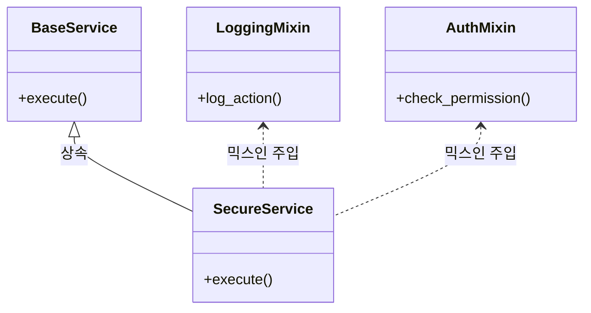

# 08. 믹스인(Mixin) 개념 및 활용

믹스인(Mixin)은 객체 지향 프로그래밍에서 **코드를 재사용하기 위한 기법** 중 하나로, 클래스에 특정 기능을 '섞어 넣기' 위해 사용됩니다. 특히 파이썬(Django) 환경에서 매우 빈번하게 사용되는 패턴입니다.

---

## 🏗 믹스인이란? (Definition)

믹스인은 **독립적으로는 인스턴스화되지 않으며**, 다른 클래스에 추가적인 기능을 제공하기 위해 설계된 클래스입니다.

- **핵심 특징**:
  1. 단독으로 사용되지 않음 (부모 클래스가 아님).
  2. 다중 상속을 통해 기능을 주입함.
  3. "is-a" 관계(상속)보다는 **"has-a" 또는 "can-do" 관계(기능 추가)**에 가까움.

---

## 🔄 믹스인의 동작 원리 (Conceptual Diagram)



---

## 💻 파이썬 실무 예제

### 1. 단순 로깅 믹스인
```python
class LoggingMixin:
    def log(self, message):
        print(f"[LOG] {datetime.now()}: {message}")

class DataProcessor(LoggingMixin):
    def process(self):
        self.log("데이터 처리를 시작합니다.")
        # 처리 로직...
        self.log("데이터 처리가 완료되었습니다.")
```

### 2. Django에서의 믹스인 (LoginRequiredMixin)
장고(Django)의 Class Based View(CBV)에서 권한 확인을 위해 널리 사용됩니다.
```python
from django.contrib.auth.mixins import LoginRequiredMixin
from django.views.generic import ListView

class SecretDataView(LoginRequiredMixin, ListView):
    """로그인한 사용자만 접근 가능한 데이터 뷰"""
    model = SecretData
    template_name = "secret.html"
```

---

## ⚖️ 상속(Inheritance) vs 믹스인(Mixin) vs 합성(Composition)

| 구분 | 상속 (Inheritance) | 믹스인 (Mixin) | 합성 (Composition) |
| :--- | :--- | :--- | :--- |
| **관계** | "A는 B이다" (is-a) | "A는 B 기능을 가진다" | "A는 B를 포함한다" (has-a) |
| **구조** | 깊은 계층 구조 발생 가능 | 다중 상속을 통한 수평적 확장 | 객체 내부에 인스턴스 소유 |
| **장점** | 구조적 일관성 | 코드 재사용성 극대화 | 결합도가 낮고 유연함 |

---

## 🚀 자산운용 플랫폼에서의 활용 제안

퀀트 엔진이나 데이터 파이프라인 설계 시 믹스인을 다음과 같이 활용할 수 있습니다.

1.  **`ValidationMixin`**: 다양한 데이터 수집 객체에 공통적으로 데이터 정합성 체크 기능을 주입.
2.  **`NotificationMixin`**: 특정 배치 작업이 끝났을 때 Slack이나 이메일로 알림을 보내는 기능을 주입.
3.  **`PerformanceMixin`**: 각 연산 모듈의 실행 시간을 측정하고 로깅하는 기능을 주입.

---

## 💡 면접용 핵심 요약

> "**믹스인(Mixin)**은 다중 상속을 활용하여 클래스에 특정 기능을 유연하게 추가하는 설계 패턴입니다. 깊은 상속 계층을 만들지 않으면서도 코드를 재사용할 수 있다는 장점이 있습니다.
> 저는 에잇퍼센트나 티맥스핀테크에서 다양한 금융 로직을 처리할 때, 공통적인 로깅이나 권한 검사, 데이터 검증 로직을 **믹스인 형태로 모듈화**하여 중복을 제거하고 유지보수성을 높인 경험이 있습니다."
