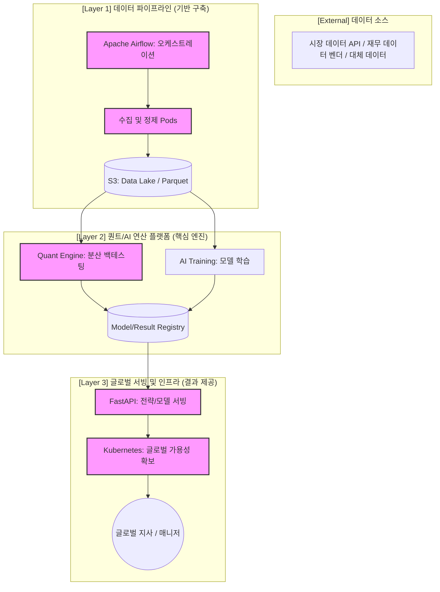

# 02. 직무의 큰 그림 및 시스템 아키텍처 개요

미래에셋자산운용 Platform Engineering 팀의 Backend Engineer로서 마주하게 될 **전체 시스템의 구조(Big Picture)**와 그 안에서 **나의 구체적인 역할**을 정의합니다.

---

## 🌐 직무의 큰 그림: 글로벌 AI/퀀트 자산운용 플랫폼

본 직무의 핵심은 전 세계에서 발생하는 방대한 금융 데이터를 수집하여, AI 모델과 퀀트 전략이 심리스(Seamless)하게 구동되고 그 결과가 글로벌 지사에 안정적으로 서빙되는 **엔드투엔드(E2E) 플랫폼**을 구축하는 것입니다.

### 통합 시스템 아키텍처 (Big Picture)

---

## 🎯 포지션의 역할: "플랫폼의 혈관을 설계하고 관리하는 엔지니어"

아키텍처 상에서 Backend Engineer인 저의 역할은 단순히 코드를 짜는 것을 넘어, **데이터의 흐름(Blood flow)을 설계하고 플랫폼의 안정성(Stability)을 책임지는 것**입니다.

### 1. 데이터 파이프라인 마스터 (Layer 1)
- **역할**: 방대한 로우 데이터를 '신뢰할 수 있는 데이터'로 변환하는 자동화 파이프라인 구축.
- **기여**: Airflow를 통한 워크플로우 관리와 데이터 무결성 검증 로직 구현을 통해 연산 엔진에 깨끗한 연료를 공급합니다.

### 2. 고성능 연산 인프라 최적화 (Layer 2)
- **역할**: 수만 건의 전략 시뮬레이션이 병목 없이 돌아가도록 연산 자원을 오케스트레이션.
- **기여**: Kubernetes Job을 활용한 분산 처리와 벡터화 연산 최적화를 통해 백테스팅 시간을 단축시킵니다.

### 3. 견고한 API 아키텍처 및 서빙 (Layer 3)
- **역할**: 연산 결과와 AI 모델을 전 세계 어디서든 저지연(Low-latency)으로 호출할 수 있는 인터페이스 구축.
- **기여**: FastAPI 기반의 비동기 서빙 구조와 클라우드 네이티브 인프라 관리를 통해 서비스 가용성을 보장합니다.

---

## 🚀 기술적 도전 과제 및 나의 강점 매칭

| 기술적 아젠다 | 상세 내용 | 나의 강점 (Fit) |
| :--- | :--- | :--- |
| **데이터 정합성** | 금융 데이터의 시점 정렬 및 무결성 확보 | 21억 건의 데이터 리팩토링 및 대사 시스템 구축 경험 |
| **시스템 확장성** | 글로벌 사용량 증가에 따른 유연한 인프라 확장 | SVN에서 Git/Jenkins 이관 및 K8s 기반 현대화 경험 |
| **복잡도 관리** | 수많은 금융 상품과 전략 로직의 모듈화 | Strategy/Factory 패턴을 통한 80+ 로직 개선 경험 |

---

## 💡 면접용 핵심 요약 멘트

> "제가 이해한 미래에셋자산운용의 플랫폼은 **글로벌 금융 데이터를 연산 자산으로 전환하는 거대한 엔진**입니다. 저는 이 엔진의 각 부품인 파이프라인, 연산 노드, 서빙 API를 유기적으로 연결하고, 특히 **데이터의 정합성과 인프라의 확장성**이라는 두 마리 토끼를 잡는 백엔드 전문가로서 기여하고 싶습니다. 21억 건의 데이터를 다루며 숫자에 대한 신뢰를 지켜온 저의 경험은, 퀀트/AI 플랫폼의 안정성을 확보하는 데 가장 강력한 무기가 될 것입니다."
