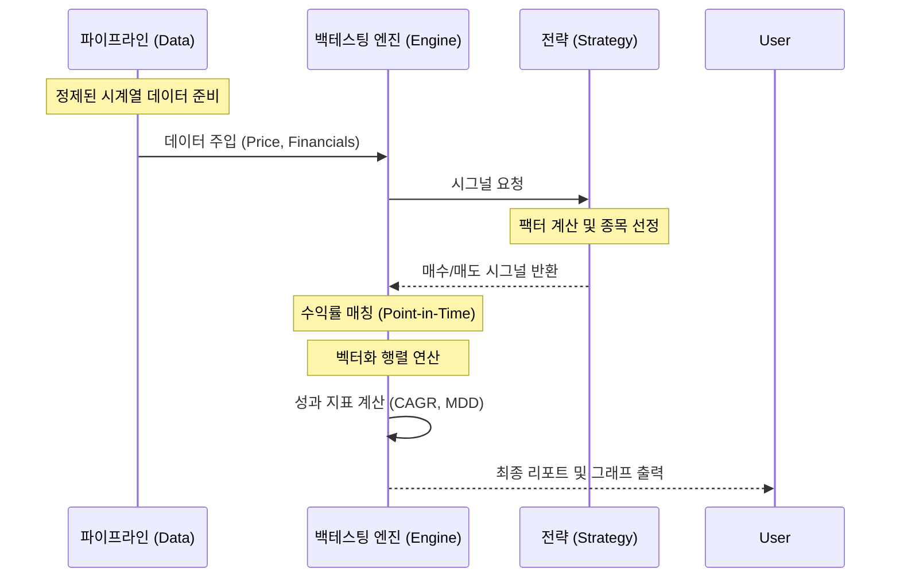

# 06. 퀀트 백테스팅 엔진 상세 (Backtest Engine)

매매 전략 백테스팅은 사용자님의 말씀대로 **저장된 과거 데이터에 특정 수식(전략)을 적용하여 시뮬레이션 연산을 수행하는 과정**이 맞습니다. 하지만 금융 플랫폼 엔지니어링 관점에서는 단순 연산을 넘어 '정합성'과 '성능'이 매우 중요합니다.

## ⚙️ 백테스팅 실행 흐름



## ⚙️ 백테스팅 엔진의 핵심 메커니즘

백테스팅 엔진은 크게 **[시그널 생성 -> 수익률 매칭 -> 성과 지표 산출]**의 3단계를 거칩니다.

### 1. 시그널 생성 (Signal Generation)
- **과정**: 정제된 재무/시장 데이터(PBR, 시가총액 등)를 수식에 대입하여 특정 시점에 어떤 종목을 매수/매도할지 결정합니다.
- **예시**: `if PBR < 0.5 and MarketCap < 20th_percentile: return BUY`
- **엔지니어링 포인트**: 
    - **Vectorization (벡터화)**: For-문(반복문)을 돌리지 않고 Pandas/NumPy의 행렬 연산을 사용하여 수만 개의 종목을 한 번에 계산합니다.

**Python 예시:**
```python
# 1. 시가총액 하위 20% 필터링 (벡터화 연산)
market_cap_limit = df.groupby("year")['시가총액'].transform(lambda x: x.quantile(0.2))
small_cap_mask = df['시가총액'] <= market_cap_limit

# 2. 저PBR 종목 선별 및 시그널 생성 (연도 x 종목 매트릭스)
selected = df[small_cap_mask].sort_values('PBR').groupby('year').head(20)
signal_df = selected.pivot(index='year', columns='Name', values='PBR').notna()
```

### 2. 수익률 매칭 (Return Alignment)
- **과정**: 결정된 시그널(매수 종목)에 실제 그다음 날 또는 그다음 달의 수익률 데이터를 곱합니다.
- **핵심 주의사항 (Look-ahead Bias)**: 
    - 미래의 데이터를 미리 보고 오늘 매수하는 오류를 방지해야 합니다. 
    - "오늘 종가를 보고 오늘 종가에 산다"는 것은 불가능하므로, 시점 정렬(T시점 시그널 -> T+1시점 수익률)이 기술적으로 매우 중요합니다.

**Python 예시:**
```python
# 일별 수익률 계산 및 시점 정렬 (T+1 수익률을 T시점으로 당김)
returns_df = price_df.pct_change().shift(-1)

# 전략 수익률 계산 (시그널과 수익률 매트릭스의 행렬 곱)
# Pandas의 인덱스 정렬(Alignment) 기능을 통해 자동으로 종목/날짜 매칭
portfolio_returns = (returns_df * signal_df.astype(int)).mean(axis=1)
```

### 3. 성과 지표 산출 (Performance Metrics)
- **과정**: 누적된 수익률 곡선을 바탕으로 전략의 우수성을 평가하는 지표를 계산합니다.
- **주요 수식**:
    - **CAGR (연평균 성장률)**: 복리 개념을 적용한 연평균 수익률
    - **MDD (최대 낙폭)**: 특정 기간 동안 고점 대비 가장 많이 하락한 비율 (위험 측정의 핵심)
    - **Sharpe Ratio (샤프 지수)**: 변동성(위험) 대비 수익이 얼마나 높은지 나타내는 지표

**Python 예시:**
```python
# 누적 수익률 계산
cum_returns = (1 + portfolio_returns).cumprod()

# CAGR 계산 (n_years: 총 투자 연수)
cagr = (cum_returns.iloc[-1] ** (1/n_years)) - 1

# MDD 계산
peak = cum_returns.cummax()
drawdown = (cum_returns - peak) / peak
mdd = drawdown.min()
```

## 🚀 엔지니어로서의 기술적 아젠다

미래에셋자산운용의 Platform Engineering 팀에서는 이 엔진을 다음과 같이 고도화하게 됩니다.

1. **분산 연산 (Distributed Computing)**:
   - 한두 개의 전략이 아니라, 수천 개의 파라미터 조합(Grid Search)을 동시에 테스트하기 위해 Kubernetes 워커 노드에 연산을 분산시킵니다.
2. **이벤트 기반 시뮬레이션 (Event-driven)**:
   - 단순 일별 데이터가 아니라, 실제 시장에서 발생하는 호가(Orderbook) 이벤트를 재현하여 슬리피지(체결 오차)까지 계산하는 정교한 엔진 구축.
3. **C++/Rust 연동**:
   - 파이썬의 속도 한계를 극복하기 위해 핵심 연산 로직(수익률 계산부)을 C++ 등으로 작성하여 `Pybind11` 등을 통해 연결.

## 🐢 백테스팅 연산이 오래 걸리는 이유 (Bottlenecks)

단순한 수익률 계산처럼 보이지만, 수만 개의 전략과 수십 년의 데이터를 다룰 때 연산이 기하급수적으로 느려지는 3가지 주요 이유가 있습니다.

### 1. 데이터 폭발 (Data Volume & I/O)
*   **계산**: `전략 조합 수(10,000개)` × `대상 종목 수(2,000개)` × `과거 데이터 기간(20년 × 252영업일)`
*   **문제**: 수십억 건의 행을 매번 메모리에 올리고 계산해야 합니다. 디스크 I/O 병목이 발생하며, 네트워크를 통해 데이터를 가져오는 시간이 연산 시간보다 길어질 수 있습니다.

### 2. 시뮬레이션의 '순차적' 성격 (Sequential Logic)
*   **문제**: 복리 수익률 계산이나 주문 체결 시뮬레이션은 '어제의 잔고가 있어야 오늘의 주문이 가능'한 순차적 구조입니다.
*   **예시 (복리 연산)**: 1일차 수익이 반영된 원금이 2일차의 투자금이 됩니다. 이를 병렬화하지 않고 단순 반복문으로 처리하면 CPU 코어 하나만 죽어라 일하게 됩니다.

### 3. 복잡한 현실 제약 사항 (Constraints Simulation)
*   **슬리피지(Slippage)**: 내가 주문을 낼 때 시장가가 변하는 현상.
*   **거래 비용**: 수수료와 세금을 매 거래마다 차감.
*   **리밸런싱**: 매달 말 종목을 교체할 때 발생하는 매매 비용과 비중 조절 계산.
*   **문제**: 단순 행렬 곱셈으로 끝나지 않고, 매 시점마다 복잡한 '조건문'과 '상태값'을 체크해야 하므로 연산 복잡도가 급증합니다.

---

## 🚀 분산 연산(Spark, Ray)의 해결 방식

| 기술 | 해결 전략 | 비유 |
| :--- | :--- | :--- |
| **Spark** | **데이터 분산**: 수십 년치 데이터를 여러 서버로 쪼개어 동시에 처리(MapReduce). | 거대한 서류 뭉치를 100명에게 나누어 주고 각자 계산하게 함. |
| **Ray** | **작업(Actor) 분산**: 수만 개의 '전략 조합'을 각각의 프로세스로 띄워 병렬 실행. | 1,000명의 요리사(Worker)가 각자 다른 레시피(전략)로 동시에 요리함. |

---

## 💡 면접용 핵심 요약
> "백테스팅은 과거의 데이터를 연료로 삼아 투자 전략이라는 엔진을 가동하는 시뮬레이션입니다. 저는 이 과정에서 **데이터의 시점 정렬(Point-in-Time)**을 엄격히 관리하여 결과의 왜곡을 방지하고, **벡터화 연산**을 통해 대규모 전략 테스트의 효율성을 극대화하는 플랫폼을 구축하는 데 기여하고 싶습니다."
