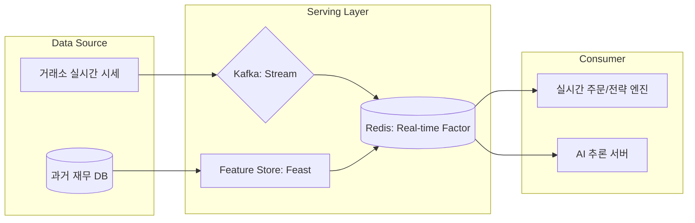

# 🚀 퀀트 데이터 서빙 및 피처 스토어 (Data Serving & Feature Store)

자산운용 플랫폼 엔지니어링에서 **데이터 서빙**은 검증된 전략과 AI 모델이 실제 시장에서 안정적으로 구동될 수 있도록 실시간 데이터를 공급하는 핵심 인프라 영역입니다.

---

## ❓ 퀀트 플랫폼에서 '실시간 데이터'를 왜 서빙하나용?

퀀트 투자는 보통 '데이터 분석'이라고만 생각하기 쉽지만, 실제 **자산운용 플랫폼 엔지니어**가 실시간 데이터를 서빙해야 하는 이유는 매우 명확합니다.

### 1. 실시간 시그널 생성 (Alpha Signal Generation)
*   **이유**: 퀀트 모델이 과거 데이터로만 학습되었다 하더라도, 실제 매매 시점에는 **현재 가격(Tick)**이 들어와야 "지금 사야 할지"를 판단할 수 있습니다.
*   **엔지니어링**: 초단위로 쏟아지는 시세를 모델에 밀어 넣어주는 **추론 파이프라인**이 필요합니다.

### 2. 실시간 포지션 및 손익 모니터링 (Live PnL & Risk)
*   **이유**: 펀드매니저는 자신이 운용하는 자산이 현재 얼마를 벌고 있는지, 리스크 한도를 넘지 않았는지를 **실시간 대시보드**로 확인해야 합니다.
*   **엔지니어링**: 실시간 시세와 보유 수량을 곱해 초단위로 PnL을 산출하여 서빙하는 API가 필수적입니다.

### 3. 주문 집행 최적화 (Execution & Slippage Control)
*   **이유**: 수천억 원의 주문을 낼 때, 시장가에 그냥 던지면 가격이 튀어버립니다(Slippage). 이를 방지하기 위해 **현재 호가창(Orderbook)** 상황을 보면서 조금씩 나누어 주문을 내는 알고리즘 트레이딩(VWAP, TWAP 등)이 실시간 데이터를 사용합니다.
*   **엔지니어링**: L1/L2 호가 데이터를 지연 없이 주문 엔진에 전달해야 합니다.

### 4. 실시간 이상 징후 탐지 (Anomaly Detection)
*   **이유**: 특정 종목이 급락하거나 시스템 로직에 오류가 생겨 잘못된 주문이 나가는 것을 실시간으로 감지하고 차단(Kill-switch)해야 합니다.

---

## 🏗️ 데이터 서빙의 4대 핵심 업무

### 1. 고성능 팩터 API 서빙 (High-Performance Factor Serving)
*   **정의**: 수천 개의 퀀트 지표(Factor)를 실시간 주문 엔진이나 대시보드에 초저지연(Low-latency)으로 제공합니다.
*   **기술적 도전**: 수억 건의 히스토리 데이터와 실시간 데이터를 결합하여 **밀리초(ms) 단위**의 응답 속도를 유지해야 합니다.
*   **주요 기술**: `Redis`, `Aerospike` (In-memory DB), `Go`, `FastAPI`.

### 2. AI 모델 서빙 및 실시간 추론 (Model Serving & Inference)
*   **정의**: 학습 완료된 AI 모델을 운영 환경에 배포하고, 실시간 시세를 입력받아 매수/매도 신호를 생성합니다.
*   **주요 작업**:
    *   **카나리 배포 (Canary Deployment)**: 신규 모델의 성능을 소액으로 먼저 검증.
    *   **Auto-scaling**: 시장 변동성이 커져 데이터 처량이 늘어날 때 추론 서버 자동 증설.
*   **주요 기술**: `Seldon Core`, `KFServing` (Kubernetes 기반), `Triton Inference Server`.

### 3. 피처 스토어 운영 (Feature Store Management)
*   **정의**: 백테스팅(연구) 환경과 트레이딩(실행) 환경 간의 **데이터 일관성**을 보장하는 중앙 저장소입니다.
*   **필요성**: 연구 시 사용한 'PBR' 계산 로직과 실제 주문 시 사용하는 로직이 다르면 '학습-서빙 편향(Training-Serving Skew)'이 발생하여 손실로 이어질 수 있습니다.
*   **주요 기술**: `Feast`, `Hopsworks`.

### 4. 실시간 스트림 데이터 파이프라인 (Real-time Stream Ingestion)
*   **정의**: 거래소의 호가(Tick) 데이터를 정제하여 실시간 지표를 산출하고 이를 서빙 레이어로 전달합니다.
*   **주요 작업**: 실시간 이동평균 계산, RSI 등 기술적 지표의 스트리밍 산출.
*   **주요 기술**: `Apache Kafka`, `Apache Flink`, `Spark Streaming`.

---

## 📊 서빙되는 데이터의 구체적 예시 (Data Examples)

자산운용 플랫폼에서 실제로 서빙되는 데이터는 크게 3가지 카테고리로 나뉩니다.

### 1. 실시간 시장 데이터 (Real-time Market Data)
거래소에서 쏟아지는 원천 데이터와 이를 가공한 기초 지표입니다.
*   **현재가/호가 (L1/L2 Feed)**: 종목별 매수/매도 최우선 호가 및 잔량.
*   **체결 강도 (Volume Power)**: 매수 체결량과 매도 체결량의 비율을 통한 실시간 수급 파악.
*   **실시간 변동성 (Real-time Volatility)**: 최근 N분간의 주가 움직임을 바탕으로 계산된 위험 지표.

### 2. 가공된 팩터 데이터 (Refined Factor Data)
전략 엔진이 종목을 선정할 때 사용하는 '재료'입니다. 주로 피처 스토어에 저장되어 서빙됩니다.
*   **가치 지표 (Value Factors)**: 실시간 주가와 직전 분기 재무제표를 결합한 **실시간 PBR, PER**.
*   **기술적 지표 (Technical Indicators)**: 5분/20분/60분 **이동평균(MA)**, **RSI**(상대강도지수), **MACD**.
*   **대체 데이터 (Alternative Data)**: 뉴스 기사의 **긍/부정 점수(Sentiment Score)**, SNS 언급 횟수 등.

### 3. 모델 출력 및 시그널 데이터 (Model Outputs & Signals)
AI 모델이나 퀀트 로직이 최종적으로 뱉어내는 '의사결정' 데이터입니다.
*   **알파 시그널 (Alpha Signals)**: 특정 종목의 향후 상승/하락 확률 또는 기대 수익률 점수.
*   **포트폴리오 비중 (Target Weights)**: 리밸런싱 시점에 각 종목을 전체 자산 중 몇 % 보유해야 하는지에 대한 목표값.
*   **이상 징후 알림 (Anomaly Alerts)**: 평소와 다른 급격한 가격 변동이나 거래량 폭증 시 발생하는 경고 신호.

---

## 🛠️ 서빙 아키텍처 흐름도

---

## 💡 플랫폼 엔지니어의 핵심 가치 (면접 포인트)

### 1. 데이터의 신선도 (Data Freshness)
*   "시장의 변화가 즉시 모델에 반영되도록 스트림 파이프라인의 지연 시간(Latency)을 최소화하는 것이 서빙 인프라의 존재 이유입니다."

### 2. 데이터 정합성 (Consistency)
*   "연구용 파이썬 코드와 운영용 자바/고 코드가 같은 데이터 결과를 보장하도록 **피처 스토어**를 통해 데이터 리니지를 관리하는 것이 저의 강점입니다."

### 3. 안정성 및 복구 (Reliability)
*   "실시간 서빙 레이어의 장애는 곧 직접적인 금전적 손실로 이어집니다. 고가용성(HA) 구성과 철저한 모니터링 시스템 구축은 선택이 아닌 필수입니다."

---

## 📂 연관 문서
*   [09. 플랫폼 아키텍처 추측](./01_company_info/09_platform_architecture_prediction.md)
*   [06. 백테스팅 엔진 상세](./06_technical_agenda/06_backtest_engine_detail.md)
