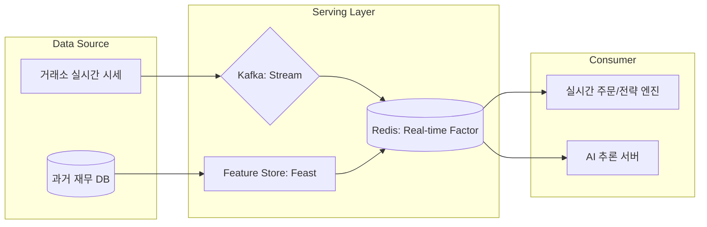

# 🚀 퀀트 데이터 서빙 및 피처 스토어 (Data Serving & Feature Store)

자산운용 플랫폼 엔지니어링에서 **데이터 서빙**은 검증된 전략과 AI 모델이 실제 시장에서 안정적으로 구동될 수 있도록 실시간 데이터를 공급하는 핵심 인프라 영역입니다.

---

## 🏗️ 데이터 서빙의 4대 핵심 업무

### 1. 고성능 팩터 API 서빙 (High-Performance Factor Serving)
*   **정의**: 수천 개의 퀀트 지표(Factor)를 실시간 주문 엔진이나 대시보드에 초저지연(Low-latency)으로 제공합니다.
*   **기술적 도전**: 수억 건의 히스토리 데이터와 실시간 데이터를 결합하여 **밀리초(ms) 단위**의 응답 속도를 유지해야 합니다.
*   **주요 기술**: `Redis`, `Aerospike` (In-memory DB), `Go`, `FastAPI`.

### 2. AI 모델 서빙 및 실시간 추론 (Model Serving & Inference)
*   **정의**: 학습 완료된 AI 모델을 운영 환경에 배포하고, 실시간 시세를 입력받아 매수/매도 신호를 생성합니다.
*   **주요 작업**:
    *   **카나리 배포 (Canary Deployment)**: 신규 모델의 성능을 소액으로 먼저 검증.
    *   **Auto-scaling**: 시장 변동성이 커져 데이터 처량이 늘어날 때 추론 서버 자동 증설.
*   **주요 기술**: `Seldon Core`, `KFServing` (Kubernetes 기반), `Triton Inference Server`.

### 3. 피처 스토어 운영 (Feature Store Management)
*   **정의**: 백테스팅(연구) 환경과 트레이딩(실행) 환경 간의 **데이터 일관성**을 보장하는 중앙 저장소입니다.
*   **필요성**: 연구 시 사용한 'PBR' 계산 로직과 실제 주문 시 사용하는 로직이 다르면 '학습-서빙 편향(Training-Serving Skew)'이 발생하여 손실로 이어질 수 있습니다.
*   **주요 기술**: `Feast`, `Hopsworks`.

### 4. 실시간 스트림 데이터 파이프라인 (Real-time Stream Ingestion)
*   **정의**: 거래소의 호가(Tick) 데이터를 정제하여 실시간 지표를 산출하고 이를 서빙 레이어로 전달합니다.
*   **주요 작업**: 실시간 이동평균 계산, RSI 등 기술적 지표의 스트리밍 산출.
*   **주요 기술**: `Apache Kafka`, `Apache Flink`, `Spark Streaming`.

---

## 🛠️ 서빙 아키텍처 흐름도

---

## 💡 플랫폼 엔지니어의 핵심 가치 (면접 포인트)

### 1. 데이터의 신선도 (Data Freshness)
*   "시장의 변화가 즉시 모델에 반영되도록 스트림 파이프라인의 지연 시간(Latency)을 최소화하는 것이 서빙 인프라의 존재 이유입니다."

### 2. 데이터 정합성 (Consistency)
*   "연구용 파이썬 코드와 운영용 자바/고 코드가 같은 데이터 결과를 보장하도록 **피처 스토어**를 통해 데이터 리니지를 관리하는 것이 저의 강점입니다."

### 3. 안정성 및 복구 (Reliability)
*   "실시간 서빙 레이어의 장애는 곧 직접적인 금전적 손실로 이어집니다. 고가용성(HA) 구성과 철저한 모니터링 시스템 구축은 선택이 아닌 필수입니다."

---

## 📂 연관 문서
*   [09. 플랫폼 아키텍처 추측](./01_company_info/09_platform_architecture_prediction.md)
*   [06. 백테스팅 엔진 상세](./06_technical_agenda/06_backtest_engine_detail.md)
