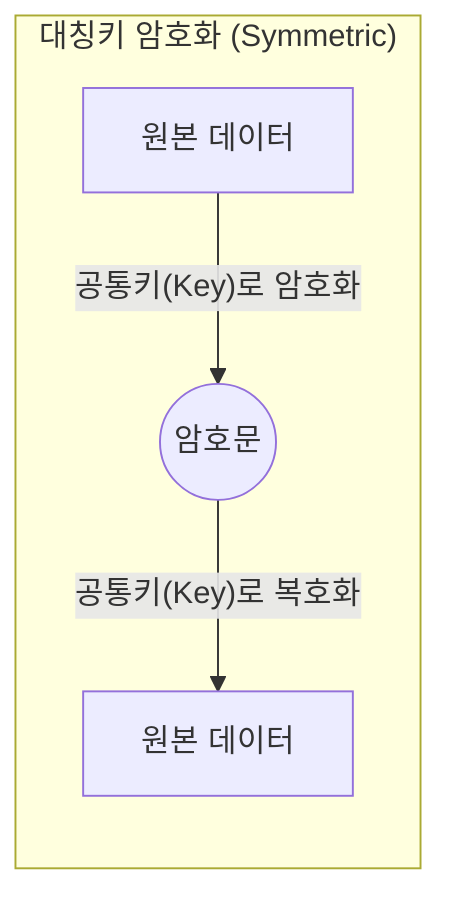
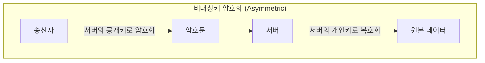
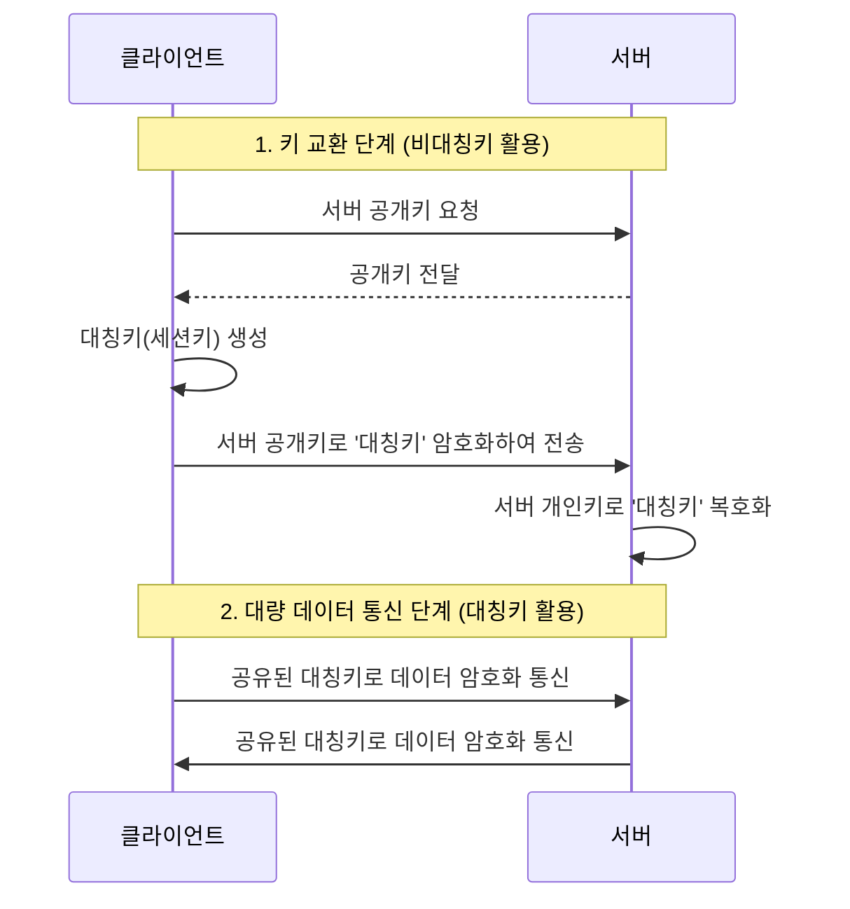

# 🔐 금융 플랫폼을 위한 암호화 핵심 개념 정리

금융 시스템, 특히 자산운용 플랫폼이나 결제 시스템에서 데이터의 보안과 무결성을 지키기 위해 필수적으로 이해해야 하는 암호화 개념들을 정리합니다.

---

## 1. 대칭키 암호화 (Symmetric Encryption)
*   **개념**: 암호화할 때와 복호화할 때 **동일한 키**를 사용하는 방식입니다.
*   **비유**: 하나의 열쇠로 문을 잠그고 여는 것과 같습니다.
*   **특징**: 
    *   연산 속도가 매우 빠릅니다.
    *   **키 전달의 문제**: 송신자와 수신자가 안전하게 키를 공유해야 하는 어려움이 있습니다. 키가 유출되면 모든 데이터가 복출됩니다.
*   **대표 알고리즘**: **AES** (Advanced Encryption Standard), SEED, ARIA.
*   **금융 활용**: 대량의 거래 내역 DB 암호화, 세션 데이터 암호화 등.

---

## 2. 비대칭키 암호화 (Asymmetric Encryption / Public Key)
*   **개념**: **공개키(Public Key)**와 **개인키(Private Key)**라는 한 쌍의 키를 사용하는 방식입니다.
*   **비유**: 공개키는 누구나 넣을 수 있는 '우체통'이고, 개인키는 집주인만 가진 '우체통 열쇠'입니다.
*   **특징**:
    *   공개키로 암호화한 것은 짝이 맞는 개인키로만 풀 수 있습니다.
    *   키 전달 문제가 해결됩니다 (공개키는 공개해도 안전함).
    *   대칭키에 비해 연산 속도가 매우 느립니다.
*   **대표 알고리즘**: **RSA**, ECC (타원곡선암호).
*   **금융 활용**: **공인인증서**, HTTPS(SSL/TLS) 통신 초기 단계, 디지털 서명.

---

## 3. 키 관리 방식에 따른 분류

### 🔑 양쪽이 키를 들고 있는 경우 (Shared Secret)
*   **방식**: 대칭키 암호화 방식입니다.
*   **활용**: 서버 간 통신 시 사전에 협의된 Secret Key를 환경 변수로 들고 통신하는 경우 (예: API Key/Secret).
*   **장점**: 통신 시마다 키를 교환할 필요가 없어 빠릅니다.

### 🔑 한쪽만 키를 들고 있는 경우 (Public Key Infrastructure)
*   **방식**: 비대칭키 암호화 방식입니다.
*   **활용**: 클라이언트는 서버의 공개키를 가지고 데이터를 암호화해서 보내고, 서버만 가진 개인키로 이를 복호화합니다.
*   **장점**: 클라이언트가 키를 탈취당해도 서버의 데이터를 풀 수 없어 보안성이 뛰어납니다.

---

## 4. 단방향 암호화 (Hash Function)
*   **개념**: 암호화는 가능하지만 **복호화(원래대로 돌리기)가 불가능**한 방식입니다.
*   **특징**: 동일한 입력값에 대해 항상 동일한 출력값이 나오며, 입력값이 조금만 달라도 결과가 완전히 달라집니다 (눈사태 효과).
*   **대표 알고리즘**: **SHA-256**, SHA-3, BCrypt.
*   **금융 활용**: **비밀번호 저장**, 데이터 위변조 확인 (Check-sum), 블록체인.

---

## 💡 금융 플랫폼 엔지니어의 핵심 포인트

### 1. 하이브리드 암호화 (Hybrid Encryption)
실제 금융 시스템은 속도(대칭키)와 보안(비대칭키)을 모두 잡기 위해 두 방식을 섞어서 사용합니다.
1.  비대칭키(RSA)로 **대칭키(AES용 키)**를 암호화해서 안전하게 보냅니다.
2.  그 이후 실제 대량의 데이터는 그 **대칭키**로 빠르게 주고받습니다.

### 2. 솔팅 (Salting)
비밀번호를 해시할 때, 같은 비밀번호가 같은 해시값으로 나오는 것을 방지하기 위해 임의의 문자열(Salt)을 섞어 저장합니다. 이는 레인보우 테이블 공격을 방어하는 핵심 기술입니다.

### 3. KMS (Key Management Service)
금융권에서는 키 자체를 소스코드나 DB에 두지 않고, AWS KMS와 같은 별도의 키 관리 서비스를 사용하여 키의 생성, 회전, 폐기를 엄격히 관리합니다.

---

## 📂 연관 문서
* [07. 핵심 금융 용어 정리](../01_company_info/07_financial_terminology.md)
* [12. 데이터 서빙 및 피처 스토어](../06_technical_agenda/12_data_serving_and_feature_store.md)
