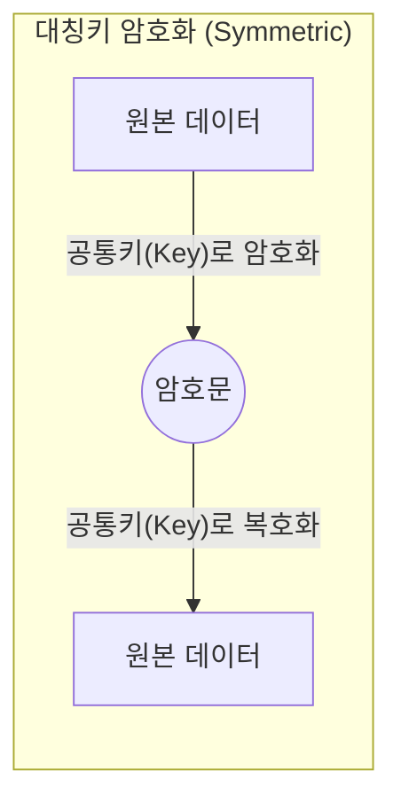
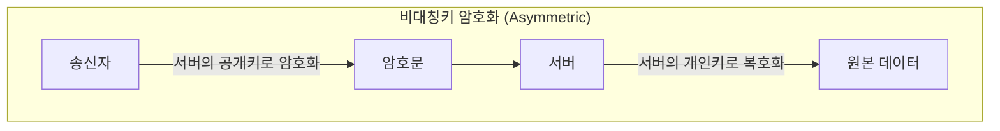
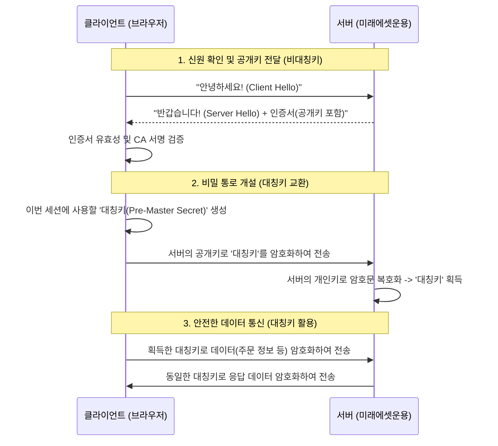
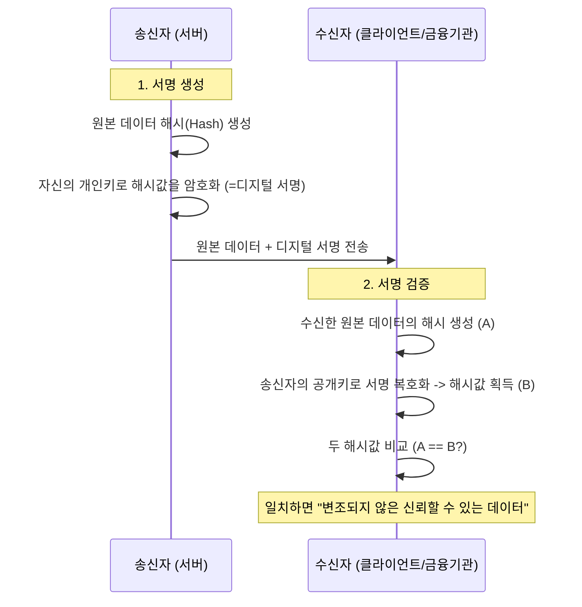

# 🔐 금융 플랫폼을 위한 암호화 핵심 개념 정리

금융 시스템, 특히 자산운용 플랫폼이나 결제 시스템에서 데이터의 보안과 무결성을 지키기 위해 필수적으로 이해해야 하는 암호화 개념들을 정리합니다.

---

## 1. 대칭키 암호화 (Symmetric Encryption)
*   **개념**: 암호화할 때와 복호화할 때 **동일한 키**를 사용하는 방식입니다.
*   **비유**: 하나의 열쇠로 문을 잠그고 여는 것과 같습니다.
*   **특징**: 
    *   연산 속도가 매우 빠릅니다.
    *   **키 전달의 문제**: 송신자와 수신자가 안전하게 키를 공유해야 하는 어려움이 있습니다. 키가 유출되면 모든 데이터가 복출됩니다.
*   **대표 알고리즘**: **AES** (Advanced Encryption Standard), SEED, ARIA.
*   **금융 활용**: 대량의 거래 내역 DB 암호화, 세션 데이터 암호화 등.

---

## 2. 비대칭키 암호화 (Asymmetric Encryption / Public Key)
*   **개념**: **공개키(Public Key)**와 **개인키(Private Key)**라는 한 쌍의 키를 사용하는 방식입니다.
*   **비유**: 공개키는 누구나 넣을 수 있는 '우체통'이고, 개인키는 집주인만 가진 '우체통 열쇠'입니다.
*   **특징**:
    *   공개키로 암호화한 것은 짝이 맞는 개인키로만 풀 수 있습니다.
    *   키 전달 문제가 해결됩니다 (공개키는 공개해도 안전함).
    *   대칭키에 비해 연산 속도가 매우 느립니다.
*   **대표 알고리즘**: **RSA**, ECC (타원곡선암호).
*   **금융 활용**: **공인인증서**, HTTPS(SSL/TLS) 통신 초기 단계, 디지털 서명.

---

## 3. 키 관리 방식에 따른 분류

### 🔑 양쪽이 키를 들고 있는 경우 (Shared Secret)
*   **방식**: 대칭키 암호화 방식입니다.
*   **활용**: 서버 간 통신 시 사전에 협의된 Secret Key를 환경 변수로 들고 통신하는 경우 (예: API Key/Secret).
*   **장점**: 통신 시마다 키를 교환할 필요가 없어 빠릅니다.

### 🔑 한쪽만 키를 들고 있는 경우 (Public Key Infrastructure)
*   **방식**: 비대칭키 암호화 방식입니다.
*   **활용**: 클라이언트는 서버의 공개키를 가지고 데이터를 암호화해서 보내고, 서버만 가진 개인키로 이를 복호화합니다.
*   **장점**: 클라이언트가 키를 탈취당해도 서버의 데이터를 풀 수 없어 보안성이 뛰어납니다.

---

## 4. 단방향 암호화 (Hash Function)
*   **개념**: 암호화는 가능하지만 **복호화(원래대로 돌리기)가 불가능**한 방식입니다.
*   **특징**: 동일한 입력값에 대해 항상 동일한 출력값이 나오며, 입력값이 조금만 달라도 결과가 완전히 달라집니다 (눈사태 효과).
*   **대표 알고리즘**: **SHA-256**, SHA-3, BCrypt.
*   **금융 활용**: **비밀번호 저장**, 데이터 위변조 확인 (Check-sum), 블록체인.

---

## 💡 금융 플랫폼 엔지니어의 핵심 포인트

### 1. 하이브리드 암호화 (Hybrid Encryption) - HTTPS/TLS 통신 예시
실제 금융 시스템은 속도(대칭키)와 보안(비대칭키)을 모두 잡기 위해 두 방식을 섞어서 사용합니다.

### 2. 디지털 서명 (Digital Signature) - 데이터 무결성 예시
보낸 사람이 정말 그 사람인지, 내용이 중간에 바뀌지 않았는지 확인할 때 사용합니다.

---

## 🛠️ 실무 활용 시나리오 (Examples)

### 예시 1: 대외 기관 API 연동 (API Key & Secret)
금융기관 간 API 통신 시 주로 사용하는 **Shared Secret** 방식입니다.
*   **시나리오**: 미래에셋 플랫폼이 은행의 계좌 조회 API를 호출할 때.
*   **동작**: 사전에 공유된 `API_SECRET`을 소금(Salt)으로 사용하여 요청 파라미터를 해시(HMAC)한 뒤 `Signature` 헤더에 담아 보냅니다. 서버는 똑같은 방식으로 해시를 만들어 서명이 일치하는지 확인합니다. (양쪽이 키를 들고 있는 대칭형 구조)

### 예시 2: 인증 토큰 보안 (JWT with RSA)
사용자 로그인 후 발급되는 **비대칭키 서명** 방식입니다.
*   **시나리오**: 마이크로서비스(MSA) 환경에서 인증 서버가 토큰을 발행할 때.
*   **동작**: 인증 서버는 자신의 **개인키**로 JWT의 서명 영역을 생성합니다. 각 주문/잔고 서버는 인증 서버의 **공개키**만 가지고 토큰의 유효성을 검증합니다. (개인키는 인증 서버만 안전하게 보관)

### 예시 3: DB 내 개인정보 암호화 (AES-256)
고객의 계좌번호나 주민번호를 DB에 저장할 때 사용하는 **대칭키** 방식입니다.
*   **시나리오**: 개인정보보호법 준수를 위한 DB 암호화.
*   **동작**: `DB_ENCRYPTION_KEY`를 사용하여 데이터를 암호화합니다. 이 키는 **AWS KMS** 같은 별도 서비스에 보관하며, 애플리케이션 실행 시에만 메모리에 올려 사용합니다.

---

## 📂 연관 문서
* [07. 핵심 금융 용어 정리](../01_company_info/07_financial_terminology.md)
* [12. 데이터 서빙 및 피처 스토어](../06_technical_agenda/12_data_serving_and_feature_store.md)

---

## ❓ 왜 공개키를 '공개'하나요? (목적과 안전성)

### 1) 무엇을 해결하나? — 키 배포 문제(Key Distribution Problem)
- 비대칭암호는 "안전하게 키를 주고받기 어렵다"는 대칭키의 근본 문제를 해결합니다.
- 수신자의 공개키만 알면 누구나 안전하게 메시지를 암호화해서 보낼 수 있고, 복호화는 오직 수신자의 개인키로만 가능합니다.
- 결과적으로, 익명의 불특정 다수에게도 "안전한 통신의 입구"를 열어 놓을 수 있습니다. (웹의 HTTPS 규모 확장의 핵심 전제)

### 2) 왜 공개해도 안전한가?
- 공개키로는 암호문을 "풀 수" 없습니다. 복호화 권한은 오직 짝이 되는 개인키에만 있습니다.
- 또한 공개키만으로는 합법적인 서명을 "만들 수" 없습니다. 서명 생성은 개인키만 할 수 있고, 공개키는 그 서명이 진짜인지 "검증"만 합니다.
- 안전성의 수학적 근거: RSA의 소인수분해, ECC의 이산로그 등 "일방향(한쪽만 쉬운)" 문제에 기반합니다.

### 3) 단, 공개키의 '주인'을 확인하는 절차가 필요 (신뢰 사슬)
- 위험: 공격자가 가짜 공개키를 배포하면 중간자공격(MITM)이 성립합니다.
- 해결: PKI(공개키 기반 구조)
  - 인증서(Certificate): 공개키 + 소유자 정보 + CA(인증기관)의 전자서명
  - 브라우저/OS가 신뢰하는 루트 CA → 중간 CA → 서버 인증서로 이어지는 체인 검증
  - 폐지/유효성: CRL/OCSP로 인증서 무효화·만료 확인
- 요약: "공개키 자체"는 공개해도 되나, "그 공개키가 진짜 주인의 것인지"를 인증서와 체인을 통해 검증해야 합니다.

### 4) 암호화와 서명의 방향성 (헷갈리기 쉬운 포인트)
- 기밀성(Encryption): 송신자가 "수신자의 공개키"로 암호화 → 수신자만 개인키로 복호화
- 무결성/부인방지(Signature): 송신자가 "자신의 개인키"로 서명 → 누구나 송신자의 공개키로 검증
- 실무: TLS는 서버 인증(서명 검증)으로 신원을 확인한 뒤, 세션키(AES)를 교환하여 데이터는 대칭키로 빠르게 암복호화합니다. (하이브리드)

### 5) 공개키 배포 방식과 베스트 프랙티스
- X.509 인증서(HTTPS/TLS), SSH 공개키(서버의 `~/.ssh/authorized_keys`), PGP 키서버 등 표준 경로 사용
- 키 핑거프린트 공유: 공개키 해시(SHA-256)를 별도 채널로 확인해 위변조 방지
- 키 핀닝(Key Pinning)/TOFU(Trust On First Use): 첫 연결 시 저장한 키 지문과 이후 비교해 변경 탐지
- 키 회전(Rotation): 개인키가 의심되면 즉시 폐기(Revocation)·재발급; 자동 회전 정책 수립

### 6) 공개하면 안 되는 것은 무엇인가?
- "개인키(Private Key)"는 절대로 공개하면 안 됩니다. HSM/KMS 등 보안 하드웨어 또는 관리형 서비스에 보관하고, 접근·사용을 감사(Audit)해야 합니다.
- "공개키"의 공개 자체는 문제되지 않지만, 출처 인증(위 3번)과 최신성·폐기 상태 관리가 반드시 동반되어야 합니다.
