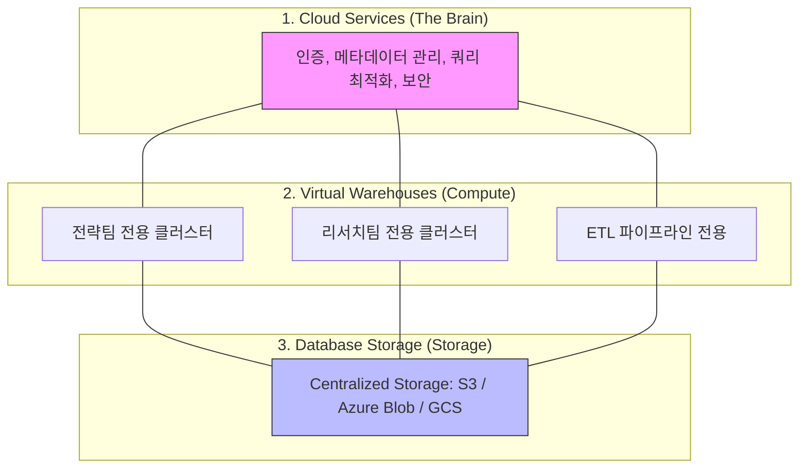

# ❄️ Snowflake: 클라우드 기반 데이터 웨어하우스 심층 분석

자산운용 플랫폼의 데이터 레이어 고도화를 위해 최근 가장 주목받는 클라우드 데이터 웨어하우스(CDW)인 **Snowflake**의 핵심 개념과 아키텍처, 그리고 기존 기술과의 차이점을 정리합니다.

---

## 🏗️ 1. Snowflake 핵심 아키텍처
Snowflake의 가장 큰 특징은 **저장(Storage)**과 **연산(Compute)**이 완전히 분리된 멀티 클러스터 공유 데이터 아키텍처입니다.

### 3계층 구조의 장점
1.  **Database Storage**: 중앙 집중식 저장소로, 데이터의 단일 진실 공급원(Single Source of Truth) 역할을 합니다.
2.  **Virtual Warehouses (Compute)**: 필요한 만큼 연산 자원을 독립적으로 띄울 수 있습니다. (전략팀이 무거운 쿼리를 돌려도 ETL 파이프라인 속도에 영향 없음)
3.  **Cloud Services**: 메타데이터 관리와 보안을 담당하며, 사용자가 인프라를 직접 관리할 필요가 없는 'Zero Management'를 실현합니다.

---

## 📊 2. Snowflake vs S3 + Parquet 비교

| 비교 항목 | AWS S3 + Parquet (Data Lake) | Snowflake (Data Warehouse) |
| :--- | :--- | :--- |
| **성격** | Raw 파일 저장소 | 완전 관리형 데이터 플랫폼 |
| **관리 부담** | 높음 (컴퓨팅 엔진, 스키마 관리 직접 수행) | 매우 낮음 (SaaS 형태로 즉시 사용 가능) |
| **성능 최적화** | 수동 (파일 크기, 파티셔닝 직접 관리) | 자동 (Micro-partitioning, 클러스터링 자동 수행) |
| **데이터 정합성** | 낮음 (파일 단위 제어 어려움) | 높음 (ACID 트랜잭션 지원) |
| **활용 시나리오** | 로우 데이터 보존, 머신러닝 학습 데이터 | 비즈니스 인텔리전스(BI), 실시간 분석 쿼리 |

**핵심 차이**: S3+Parquet은 **'재료(파일)'**라면, Snowflake는 **'완성된 주방(엔진+저장소+관리도구)'**입니다. Snowflake 내부는 실제로 독자적인 압축 컬럼 포맷을 사용하며, 이는 Parquet보다 더 정교한 메타데이터 관리를 제공합니다.

---

## 🔄 3. 일반 RDB (OLTP) vs Snowflake (OLAP)

| 비교 항목 | 일반 RDB (MySQL, PostgreSQL) | Snowflake |
| :--- | :--- | :--- |
| **주 목적** | **OLTP**: 잦은 수정, 삭제, 단건 조회 | **OLAP**: 대규모 데이터 분석 및 집계 |
| **저장 방식** | **Row-based**: 행 단위 저장 (빠른 쓰기) | **Columnar**: 열 단위 저장 (빠른 읽기/압축) |
| **확장성** | **수직 확장(Scale-up)** 위주, 복잡함 | **수평 확장(Scale-out)** 무한대, 자동 수행 |

---

## 📈 4. 수직 확장(Scale-up) vs 수평 확장(Scale-out) 상세

데이터 플랫폼의 부하가 늘어날 때 이를 해결하는 두 가지 철학적 차이입니다.

### 🏢 1) 수직 확장 (Scale-up)
- **개념**: 기존 서버의 **하드웨어 사양(CPU, RAM)을 더 좋은 것으로 교체**하는 방식입니다.
- **특징**:
    - **장점**: 소프트웨어 구조를 바꿀 필요가 없어 관리가 단순합니다.
    - **단점**: 하드웨어 성능에는 물리적 한계가 있으며, 성능이 올라갈수록 가격이 기하급수적으로 비싸집니다. 교체 시 서비스 중단(Downtime)이 발생할 수 있습니다.
- **일반 RDB가 이를 선호하는 이유**: 데이터의 일관성(ACID)을 지키기 위해서는 하나의 뇌(CPU)가 장부를 관리하는 것이 가장 안전하기 때문입니다.

### 🚀 2) 수평 확장 (Scale-out)
- **개념**: 똑같은 성능의 **서버를 여러 대 추가하여 부하를 분산**하는 방식입니다.
- **특징**:
    - **장점**: 이론상 무한대로 확장이 가능하며, 장비 하나가 죽어도 다른 장비가 대체할 수 있어 고가용성(HA) 확보에 유리합니다.
    - **단점**: 데이터를 여러 장비에 골고루 나누고(Sharding), 다시 합치는 과정이 매우 복잡합니다.
- **Snowflake가 이를 자동화한 방식**: 
    - **Storage-Compute 분리**: 데이터는 한 곳(S3)에 있고, 연산 장치(Warehouse)만 옆으로 늘리면 됩니다. 
    - **Auto-scaling**: 쿼리량이 많아지면 Snowflake가 알아서 연산 노드를 1대에서 10대로 늘렸다가, 작업이 끝나면 다시 줄여 비용을 최적화합니다.

---

## 💡 퀀트 플랫폼 엔지니어링 관점에서의 가치

### 1. Zero Copy Cloning (데이터 복제 제로)
*   **기능**: 실제 데이터를 물리적으로 복사하지 않고도 메타데이터만 복제하여 실시간으로 개발/스테이징 환경을 만듭니다.
*   **퀀트 활용**: 10년치 시계열 데이터를 복사하는 비용과 시간 없이, 분석가에게 즉시 실험용 샌드박스 환경을 제공할 수 있습니다.

### 2. Time Travel (타임 트래블)
*   **기능**: 과거 특정 시점(최대 90일)의 데이터를 즉시 조회하거나 복구할 수 있습니다.
*   **퀀트 활용**: 백테스팅 중 데이터 오류가 발견되었을 때, "어제 오후 2시 시점의 데이터 상태"로 엔진을 돌려보며 원인을 파악할 수 있습니다. (**PIT 정합성** 확보에 매우 유리)

### 3. Data Sharing (데이터 공유)
*   **기능**: 외부 벤더의 데이터를 복사(ETL)하지 않고도 Snowflake 네트워크 내에서 즉시 참조할 수 있습니다.
*   **퀀트 활용**: 데이터 공급업체(Bloomberg 등)가 Snowflake를 지원한다면, 복잡한 수집 파이프라인 없이 실시간으로 원천 데이터를 조회할 수 있습니다.

---

## 🚀 면접용 핵심 멘트

> "Snowflake는 단순히 클라우드에 있는 DB가 아니라, **저장과 연산을 완전히 분리하여 자원의 효율성을 극대화한 플랫폼**입니다. 
> 특히 퀀트 플랫폼 엔지니어로서 주목하는 점은 **Time Travel** 기능을 통한 데이터 정합성 유지와, **Zero Copy Cloning**을 활용해 수 TB의 시계열 데이터를 분석가에게 비용 효율적으로 제공할 수 있다는 점입니다. 
> 인프라 관리 부담을 줄이고 대신 **데이터 모델링과 분석 성능 최적화**에 더 집중할 수 있게 해주는 것이 Snowflake의 가장 큰 강점이라고 생각합니다."
