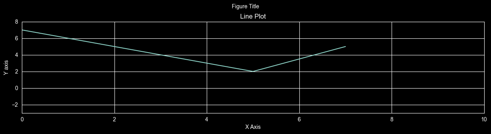
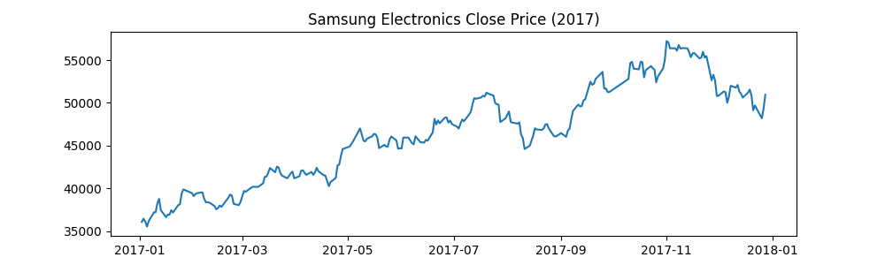
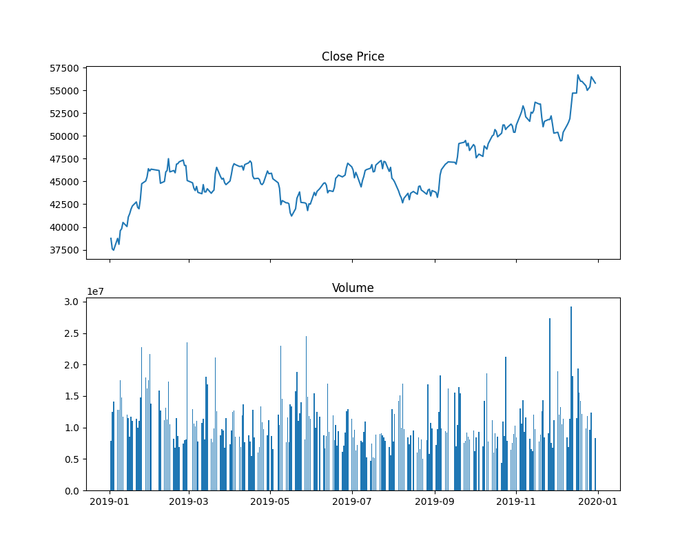
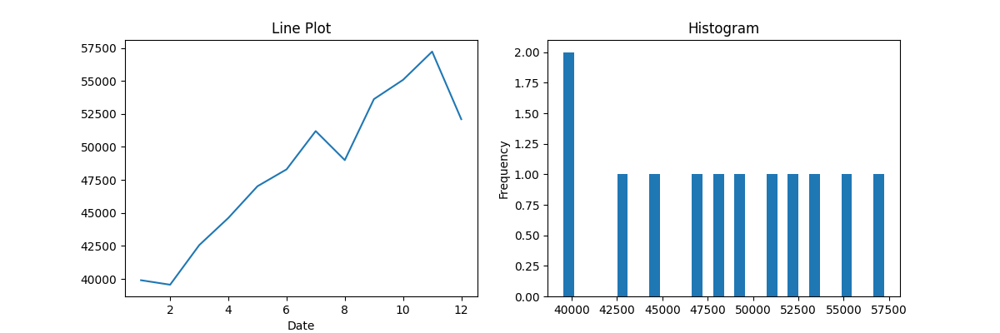
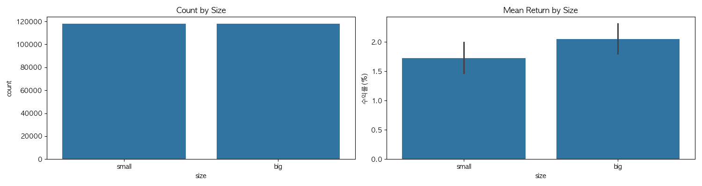
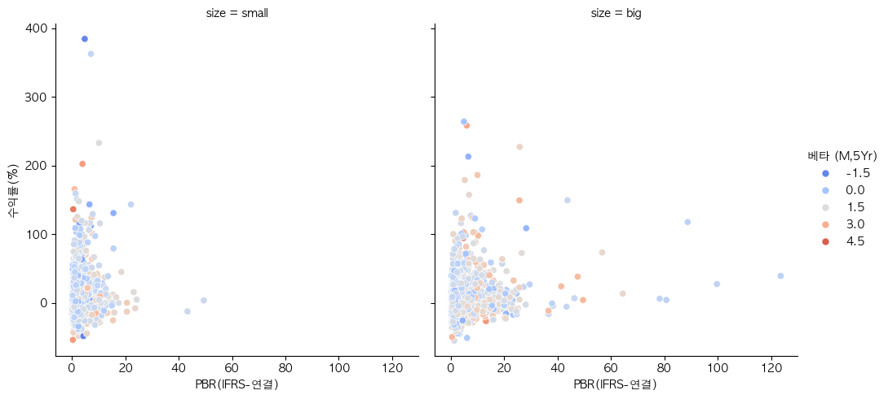
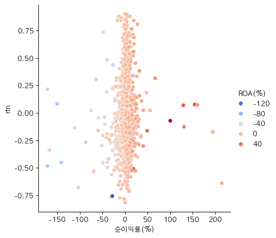

# Lec 1-5: 데이터 시각화 (Visualization)

이 장에서는 데이터 분석의 결과를 직관적으로 이해하기 위한 시각화 도구인 **Matplotlib**, **Pandas Plot**, 그리고 **Seaborn**의 사용법을 학습합니다. 퀀트 투자에서 주가 차트, 수익률 분포, 변동성 분석 등을 수행할 때 필수적인 기술입니다.

---

## 0. Matplotlib이란?

**Matplotlib**은 파이썬에서 2D 그래프와 도표를 그릴 때 사용하는 가장 기본적인 **핵심 시각화 라이브러리**입니다.


*출처: matplotlib.org*


- **기반 라이브러리**: NumPy 배열을 기반으로 만들어졌으며, Pandas와 Seaborn 같은 고수준 시각화 도구들도 내부적으로는 Matplotlib을 사용하여 그래프를 그립니다.
- **범용성**: 선 그래프(Line), 막대 그래프(Bar), 히스토그램(Hist), 산점도(Scatter) 등 거의 모든 종류의 2차원 차트를 생성할 수 있습니다.
- **세밀한 제어**: 그래프의 축, 라벨, 타이틀, 선의 굵기, 색상 등 모든 요소를 아주 세밀하게 조정할 수 있는 강력한 기능을 제공합니다.
- **퀀트 활용**: 주가 데이터의 시계열 분석, 전략의 백테스트 결과 시각화, 리스크 분포 분석 등에 널리 활용됩니다.

### 0.1. 주요 구성 요소
Matplotlib 그래프는 크게 두 가지 층으로 나뉩니다.
1. **Figure**: 전체 그래프가 그려질 '도화지' 혹은 '틀'입니다.
2. **Axes**: Figure 안에 실제로 데이터가 플로팅되는 '좌표계' 혹은 '공간'입니다. 하나의 Figure는 여러 개의 Axes를 가질 수 있습니다.

---

## 1. Matplotlib 인터페이스 이해

Matplotlib은 두 가지 인터페이스를 제공하지만, 확장성과 명확성을 위해 **객체 지향(Stateless) 방식**의 사용이 강력히 권장됩니다.

### 1.1. 인터페이스 비교
- **Stateful (상태 유지) 방식**: `plt.plot()` 처럼 현재 활성화된 Figure나 Axes에 암묵적으로 명령을 내리는 방식. 간단한 테스트용으로만 사용합니다.
- **Stateless (객체 지향) 방식**: `Figure`와 `Axes` 객체를 명시적으로 생성하고, 해당 객체의 메서드를 호출하여 제어하는 방식. 코드의 가독성이 높고 복잡한 레이아웃 구현에 유리합니다.

### 1.2. Stateful 방식 예시
가장 기본적인 방식으로, 별도의 객체 생성 없이 `plt`를 통해 즉시 그래프를 그립니다.

```python
import matplotlib.pyplot as plt

x = [-3, 5, 7]
y = [10, 2, 5]

# Figure 크기 설정
plt.figure(figsize=(15, 3));

# 그래프 그리기
plt.plot(x, y);

# 축 범위 설정
plt.xlim(0, 10);
plt.ylim(-3, 8);

# 축 라벨 설정
plt.xlabel('X Axis');
plt.ylabel('Y axis');

# 제목 설정
plt.title('Line Plot');
plt.suptitle('Figure Title', size=10, y=1.03);

# 실행 결과: 지정된 범위와 라벨을 가진 선 그래프 출력
```



### 1.3. FinanceDataReader 활용 예시
Matplotlib을 사용하기 전, 실제 금융 데이터를 로드하는 방법입니다.
```python
import FinanceDataReader as fdr

# 삼성전자 주가 데이터 로드 (2017년)
samsung_df = fdr.DataReader('005930', '2017-01-01', '2017-12-31')
samsung_df.head()

# 실행 결과: Date를 인덱스로 하는 Open, High, Low, Close, Volume 등의 컬럼을 가진 DataFrame 출력
```

### 1.4. 객체 지향(Object-Oriented) 방식 예시
```python
import matplotlib.pyplot as plt
import FinanceDataReader as fdr

# 삼성전자 주가 데이터 로드
samsung_df = fdr.DataReader('005930', '2017-01-01', '2017-12-31')

# Figure(틀)와 Axes(그래프 공간) 생성
# figsize=(가로, 세로): 그래프의 크기를 인치(inch) 단위로 설정
fig, ax = plt.subplots(figsize=(10, 3))

# Axes 객체에 삼성전자 종가 그래프 그리기
ax.plot(samsung_df.index, samsung_df['Close'])

# 축 범위 설정 (xlim: x축, ylim: y축)
# ax.set_xlim(0, 10) # 시계열 데이터의 경우 자동으로 설정되나 수동 조절 가능
# ax.set_ylim(-3, 8)

# 축 라벨 및 그래프 제목 설정
ax.set_xlabel('Date')
ax.set_ylabel('Price')
ax.set_title('Samsung Electronics Close Price (2017)')

# Figure 전체 제목 설정 (size: 폰트 크기, y: 제목의 높이 조절)
fig.suptitle('Figure Title', size=12, y=1.05)

# 실행 결과: 2017년 삼성전자 주가 흐름을 보여주는 선 그래프 출력
```



### 1.5. 다중 그래프 (Subplots) 제어
`plt.subplots(nrows, ncols)`는 `Figure` 객체와 `Axes` 객체(들)의 **NumPy 배열**을 반환합니다.
```python
# 2행 1열 서브플롯 생성, 가로 크기 10, 세로 크기 8
# sharex=True: 모든 서브플롯이 x축 범위를 공유하도록 설정
fig, axes = plt.subplots(nrows=2, ncols=1, figsize=(10, 8), sharex=True)

# axes 배열에서 인덱싱을 통해 각 Axes 공간에 접근
ax1 = axes[0]  # 첫 번째 행 (위쪽 그래프)
ax2 = axes[1]  # 두 번째 행 (아래쪽 그래프)

# 위쪽 그래프: 주가 종가(close_series) 선 그래프
ax1.plot(close_series)
ax1.set_title('Close Price')

# 아래쪽 그래프: 거래량(volume_series) 막대 그래프
ax2.bar(volume_series.index, volume_series)
ax2.set_title('Volume')

# 실행 결과: 위에는 주가, 아래에는 거래량이 배치된 상하 2단 차트 출력
```



### 1.6. Axes 세부 컴포넌트 제어
- **Spines**: 그래프를 둘러싼 테두리.
- **Axis (xaxis, yaxis)**: 축 자체를 의미하며, `ticks`(눈금)와 `labels`(라벨)를 포함합니다.
- **Legend**: `ax.legend()`를 통해 범례를 표시할 수 있습니다.

---

## 2. Pandas 내장 Plotting

Pandas 객체(`Series`, `DataFrame`)에서 직접 `.plot()`을 호출하면 내부적으로 Matplotlib을 사용합니다.

- **데이터 형태**: `price_max_df['삼성전자']`는 인덱스가 '월(Month)'이고 값이 '종가(Close)'인 **Pandas Series** 객체입니다. Pandas Plot은 인덱스를 x축으로, 값을 y축으로 자동으로 매핑합니다.
- **자동 Figure 생성**: `ax` 인자를 전달하지 않고 `df.plot()`을 호출하면 Pandas가 **내부적으로 새로운 Figure와 Axes를 자동으로 생성**하여 그래프를 그립니다.
- **Axes 활용(Subplot 통합)**: `ax` 인자에 미리 생성한 Matplotlib의 `Axes` 객체를 전달하면, 사용자가 원하는 위치(서브플롯)에 그래프를 삽입할 수 있어 복잡한 레이아웃 구성이 가능합니다.

```python
# 1행 2열의 서브플롯 생성
fig, axes = plt.subplots(1, 2, figsize=(12, 4))

# 1. 삼성전자 종가(Series)를 첫 번째 서브플롯(axes[0])에 선 그래프로 그림
# price_max_df['삼성전자']의 데이터 타입은 Series입니다.
price_max_df['삼성전자'].plot(ax=axes[0], kind='line', title='Line Plot')

# 2. 동일한 데이터를 두 번째 서브플롯(axes[1])에 히스토그램으로 그림
price_max_df['삼성전자'].plot(ax=axes[1], kind='hist', bins=30, title='Histogram')

# 참고: ax 인자 없이 호출하면 별도의 새 창(또는 셀)에 그래프가 그려집니다.
# price_max_df['삼성전자'].plot(kind='line') 

# 실행 결과: 왼쪽에는 주가 흐름, 오른쪽에는 주가 분포가 표시된 그래프 출력
```



- **주요 `kind` 옵션**: `line`, `bar`, `scatter`, `hist`, `box`, `kde`(밀도 추정) 등.

---

## 3. Seaborn을 활용한 고급 시각화

Seaborn은 통계 분석에 특화된 고수준 라이브러리로, Matplotlib보다 더 아름답고 복잡한 그래프를 쉽게 그릴 수 있게 해줍니다. Seaborn 함수는 크게 두 가지 종류로 나뉩니다.
1. **Axes-level 함수**: `ax` 인자를 받아 특정 공간에 그림을 그립니다. (예: `barplot`, `scatterplot`, `countplot`)
2. **Figure-level 함수**: 자체적으로 Figure를 생성하며 다차원 분할 그래프에 적합합니다. (예: `relplot`, `catplot`)

### 3.1. 범주형 데이터 분석 및 Axes 활용
`sns.barplot`과 같은 Axes-level 함수는 Matplotlib의 `ax` 객체를 전달받아 원하는 서브플롯에 그림을 그릴 수 있습니다.

**[데이터 준비 및 전처리]**
시각화에 앞서, 날짜별 시가총액의 중앙값(Median)을 계산하고 이를 기준으로 기업 규모를 구분합니다.
```python
# 1. 데이터 로드 및 중앙값 계산
df = pd.read_csv("my_data/Small_and_Big.csv", index_col=0, parse_dates=["date"])
median_df = df.groupby(['date']).agg({'시가총액 (보통)(평균)(원)': 'median'})
median_df.columns = ["median_시가총액"]

# 2. 기존 데이터와 중앙값 데이터 병합(Join)
df = df.join(median_df, on="date")

# 3. 중앙값 기준 규모(size) 컬럼 생성
# small: 시가총액 < 중앙값, big: 시가총액 >= 중앙값
df.loc[df['시가총액 (보통)(평균)(원)'] < df['median_시가총액'], "size"] = "small"
df.loc[df['시가총액 (보통)(평균)(원)'] >= df['median_시가총액'], "size"] = "big"

# 4. 분석 대상 기간 필터링 (2017년 이후)
df = df[df['date'] >= "2017-01-01"]
```

**[시각화 배경]**
위에서 생성한 `size` 컬럼이 x축의 범주(Category)가 되어, 규모별 데이터 분포와 성과를 비교합니다.
*   **small**: 시가총액이 중앙값보다 작은 기업
*   **big**: 시가총액이 중앙값보다 크거나 같은 기업

```python
import seaborn as sns

# 1행 2열 서브플롯 생성
fig, axes = plt.subplots(1, 2, figsize=(15, 4))

# 1. 항목별 빈도수(countplot)를 첫 번째 서브플롯(axes[0])에 그림
# x="size": 기업 규모(small/big)별 데이터 개수를 확인합니다.
sns.countplot(x="size", data=df, ax=axes[0])
axes[0].set_title("Count by Size")

# 2. 범주별 수익률 평균(barplot)을 두 번째 서브플롯(axes[1])에 그림
# x="size", y="수익률(%)": 규모별로 평균 수익률이 어느 정도인지 비교합니다.
# Seaborn은 평균과 오차 막대(error bar)를 자동으로 계산합니다.
sns.barplot(data=df, x="size", y="수익률(%)", ax=axes[1])
axes[1].set_title("Mean Return by Size")

# 실행 결과: 왼쪽에는 데이터 개수(small/big), 오른쪽에는 수익률 평균 막대 그래프가 나란히 출력됨
```



### 3.2. 다차원 관계 분석 (Relational Plot)
`sns.relplot()`은 여러 변수 간의 관계를 한눈에 파악하기에 매우 강력한 **Figure-level** 함수입니다.

**[핵심 파라미터 설명]**
*   **`data`**: 분석에 사용할 데이터프레임.
*   **`x`, `y`**: 각각 x축(PBR)과 y축(수익률)에 매핑될 데이터 컬럼.
*   **`hue`**: 점의 **색상**을 결정하는 변수. 여기서는 '베타' 값에 따라 색상을 입혀, 위험도(Beta)와 수익률의 관계를 시각화합니다.
*   **`col`**: 그래프를 **열(Column)** 단위로 분할하는 변수입니다. 여기서는 'size' 컬럼의 고유값인 'small'과 'big'에 따라 그래프가 좌측과 우측으로 나뉘어 **1행 2열(1x2)** 구조가 자동으로 생성됩니다. 소형주와 대형주의 패턴 차이를 직관적으로 비교할 수 있게 합니다.
*   **`kind`**: 그래프의 종류. 기본값은 `"scatter"`(산점도)이며, `"line"`으로 변경 가능합니다.
*   **`palette`**: 색상 테마. `"coolwarm"`은 낮은 값은 파란색, 높은 값은 빨간색으로 표현하여 수치의 크기를 강조합니다.

**[Figure-level 함수의 특징]**
`relplot`은 Matplotlib의 `Axes` 객체를 전달받지 않고, **자체적으로 새로운 Figure를 생성**합니다. 따라서 다차원 분할(facet)이 매우 쉽고 코드 한 줄로 복잡한 레이아웃을 구성할 수 있다는 장점이 있습니다.

```python
# Seaborn relplot을 이용한 다차원 분석
sns.relplot(
    data=df,
    x="PBR(IFRS-연결)", y="수익률(%)",
    hue="베타 (M,5Yr)",   # '베타' 값에 따라 점의 색상을 다르게 표현 (위험도 시각화)
    col="size",           # 'size' 값(Small/Big)에 따라 그래프를 좌우로 분할 (규모별 비교)
    kind="scatter",       # 기본값은 산점도
    palette="coolwarm"    # 낮은 값(Blue) ~ 높은 값(Red) 색상 테마
)

# 실행 결과: 기업 규모(Small/Big)별로 PBR-수익률 관계를 보여주는 두 개의 산점도가 나란히 출력되며,
# 점의 색상을 통해 베타(위험)가 수익률에 미치는 영향까지 동시에 파악할 수 있습니다.
```



### 3.3. 스타일 및 컨텍스트 제어
- `sns.set_style()`: 테마 설정 (white, darkgrid 등).
- `sns.plotting_context()`: 그래프의 스케일(paper, notebook, talk, poster)을 조정합니다.
```python
# 폰트 크기를 키우고 싶을 때 plotting_context 활용
with sns.plotting_context("notebook", font_scale=1.2):
    sns.relplot(data=df, x="PBR(IFRS-연결)", y="수익률(%)", col="size")
```

---

## 4. 실전 예제: 데이터 정제와 시각화

실무에서는 시각화 전 데이터를 정제하는 과정이 매우 중요합니다.

### 4.1. 이상치(Outlier) 제거 후 시각화
수익률 데이터 등에 존재하는 극단적인 이상치를 제거하면 그래프의 경향성을 더 명확히 파악할 수 있습니다.

**[데이터 준비 배경]**
이 예제에서 사용하는 `df`는 2015년부터 2017년까지 3개년도의 재무 데이터(`2015_12.csv` ~ `2017_12.csv`)를 하나로 합친 데이터프레임입니다. 각 연도별 종목의 수익률(`rtn`)과 주요 재무 지표들을 포함하고 있습니다.

**[코드 상세 설명]**
*   **루프를 통한 순차적 제거**: `for col in ['순이익률(%)', 'rtn']:` 구문은 정제하고자 하는 대상 컬럼들을 차례대로 순회합니다. 
    1. 먼저 '순이익률(%)' 컬럼의 이상치를 제거한 `df`를 만들고, 
    2. 그 다음 단계에서 이미 한 번 정제된 `df`를 대상으로 'rtn'(수익률) 컬럼의 이상치를 다시 한번 제거합니다. 
    최종적으로 두 기준을 모두 만족하는 데이터만 남게 됩니다.
*   **이상치 제거 기준**: 데이터의 평균(`mu`)에서 표준편차(`std`)의 2배를 벗어나는 값들을 제거합니다. (통계적으로 약 95%의 데이터를 포함하는 범위를 넘어서는 극단값 제외)
*   **`col` 파라미터 활용**: `relplot`에서 `col` 옵션을 사용하면 특정 기준에 따라 그래프를 여러 개의 칸(Column)으로 나누어 그릴 수 있습니다. (예: `col="연도"` 설정 시 연도별로 독립적인 그래프가 나란히 생성됨)

**[데이터 변화 구조 실례]**
실제 데이터(2015~2017 재무 데이터)를 바탕으로 루프가 돌 때마다 데이터가 어떻게 정제되는지 살펴보겠습니다.

1.  **초기 상태**: 총 1,824개의 종목 데이터로 시작합니다.
2.  **1차 순회 (`col='순이익률(%)'`)**:
    *   **계산**: mu = 8.04%, std = 122.43% -> 범위: mu ± 2σ = [-236.83%, 252.90%]
    *   **결과**: 이 범위를 벗어나는 극단적인 순이익률을 가진 **7개 종목이 제거**되어 1,817개가 남습니다.
3.  **2차 순회 (`col='rtn'`)**:
    *   **계산**: mu = 0.01, std = 0.45 -> 범위: mu ± 2σ = [-0.89, 0.91]
    *   **결과**: 1차 정제된 1,817개 중 수익률이 범위를 벗어나는 **68개 종목이 추가로 제거**됩니다.
4.  **최종 결과**:
    *   모든 필터를 통과한 **1,749개의 정제된 데이터**만이 시각화에 사용됩니다. 이 과정을 통해 소수의 극단값이 그래프 전체의 스케일을 왜곡하는 것을 방지합니다.

```python
# 1. 특정 컬럼('순이익률(%)', 'rtn')에 대해 평균 ± 2σ 범위를 벗어나는 이상치 제거
# df는 2015~2017년 재무 데이터가 병합된 상태입니다.
for col in ['순이익률(%)', 'rtn']:
    mu = df[col].mean()   # 현재 컬럼의 평균 계산
    std = df[col].std()   # 현재 컬럼의 표준편차 계산
    
    # 평균-2표준편차 ~ 평균+2표준편차 범위 내의 데이터만 선택하여 df를 갱신
    cond = (df[col] >= mu - 2*std) & (df[col] <= mu + 2*std)
    df = df[cond]

# 2. 정제된 데이터로 다차원 관계 분석(Relplot) 그리기
sns.relplot(
    x="순이익률(%)", 
    y="rtn", 
    hue="ROA(%)",    # 'ROA(%)' 값에 따라 점의 색상 변경
    palette="coolwarm", # 색상 테마 설정
    data=df
)

# 실행 결과: 순이익률과 수익률(rtn)의 상관관계를 보여주는 산점도가 출력되며, 
# ROA 값이 높을수록 붉은색, 낮을수록 파란색으로 표시되어 수익성 지표 간의 관계를 한눈에 볼 수 있습니다.
```



---

## 5. 실무 팁: 한글 깨짐 및 마이너스 기호 해결

Matplotlib은 기본적으로 한글 폰트를 지원하지 않으므로 설정이 필요합니다. 운영체제(Windows/Mac)에 상관없이 작동하는 범용 설정 코드를 사용하는 것이 좋습니다.

```python
import matplotlib.pyplot as plt
import matplotlib as mpl
import platform

# 1. 운영체제별 한글 폰트 설정
if platform.system() == 'Darwin': # Mac
    plt.rcParams["font.family"] = 'AppleGothic'
elif platform.system() == 'Windows': # Windows
    plt.rcParams["font.family"] = 'Malgun Gothic'
else: # Linux
    plt.rcParams["font.family"] = 'NanumGothic'

# 2. 마이너스 기호 깨짐 방지
# 폰트 변경 시 숫자의 '-' 기호가 깨지는 현상을 막아줍니다.
mpl.rcParams['axes.unicode_minus'] = False
```

---

## 6. 퀀트 투자 관점의 학습 포인트

1.  **시각화를 통한 이상치(Outlier) 확인**: 수익률 계산 전후로 데이터를 시각화하여 비정상적인 값(데이터 오류 등)을 반드시 걸러내야 합니다.
2.  **수익률 분포의 비정규성 파악**: `kde`나 `hist`를 통해 수익률이 정규분포를 따르는지, 아니면 '뚱뚱한 꼬리(Fat-tail)'를 가져 극단적 위험이 존재하는지 분석합니다.
3.  **다차원 팩터 분석**: 종목 특성(시총, PBR 등)에 따른 수익률 차이를 `relplot`이나 `hue` 옵션을 통해 입체적으로 분석하여 투자 아이디어를 검증합니다.

---

## 7. 주요 라이브러리 함수 정리

| 라이브러리 | 클래스/모듈 | 함수명 | 설명 |
| :--- | :--- | :--- | :--- |
| **Matplotlib** | `plt` | `subplots()` | Figure와 Axes 객체를 동시에 생성 및 반환 |
| **Matplotlib** | `plt` | `figure()` | 새로운 Figure(도화지) 생성 및 크기 설정 |
| **Matplotlib** | `plt` | `plot()` | (Stateful) 현재 활성화된 Axes에 선 그래프 생성 |
| **Matplotlib** | `plt` | `xlim() / ylim()` | (Stateful) x축 / y축의 표시 범위 설정 |
| **Matplotlib** | `plt` | `xlabel() / ylabel()` | (Stateful) x축 / y축 라벨 설정 |
| **Matplotlib** | `plt` | `title() / suptitle()` | (Stateful) 그래프 제목 / Figure 전체 제목 설정 |
| **Matplotlib** | `Axes` | `plot()` | (Stateless) 해당 Axes 공간에 선 그래프 생성 |
| **Matplotlib** | `Axes` | `bar()` | (Stateless) 해당 Axes 공간에 막대 그래프 생성 |
| **Matplotlib** | `Axes` | `set_xlim() / set_ylim()` | (Stateless) 축 표시 범위 설정 |
| **Matplotlib** | `Axes` | `set_xlabel() / set_ylabel()` | (Stateless) 축 라벨 설정 |
| **Matplotlib** | `Axes` | `set_title()` | (Stateless) 그래프 제목 설정 |
| **Matplotlib** | `Axes` | `legend()` | 범례 표시 |
| **Pandas** | `DataFrame/Series` | `plot()` | 데이터를 시각화 (내부적으로 Matplotlib 사용) |
| **Pandas** | `DataFrame` | `hist()` | 데이터프레임의 모든 수치형 변수에 대한 히스토그램 생성 |
| **Seaborn** | `sns` | `countplot()` | 항목별 빈도수를 막대 그래프로 시각화 |
| **Seaborn** | `sns` | `barplot()` | 카테고리별 평균과 오차 막대(Error Bar)를 시각화 |
| **Seaborn** | `sns` | `relplot()` | 변수 간의 관계(산점도, 선 등)를 다차원적으로 시각화 |
| **Seaborn** | `sns` | `set_style()` | Seaborn 테마(배경, 그리드 등) 설정 |
| **Seaborn** | `sns` | `plotting_context()` | 그래프 요소의 스케일(폰트 크기 등) 일괄 조정 |
| **FinanceDataReader** | `fdr` | `DataReader()` | 종목 코드와 기간을 입력받아 금융 데이터를 DataFrame으로 로드 |
