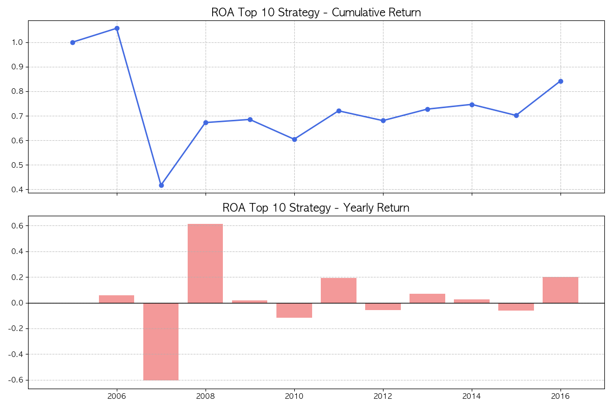
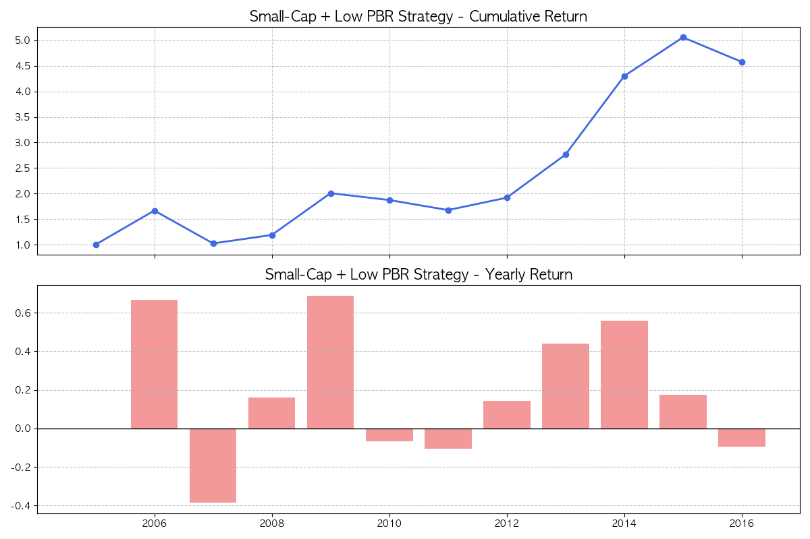
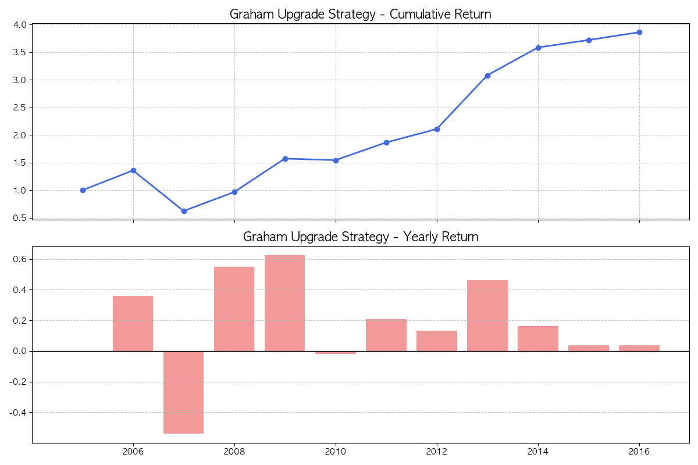
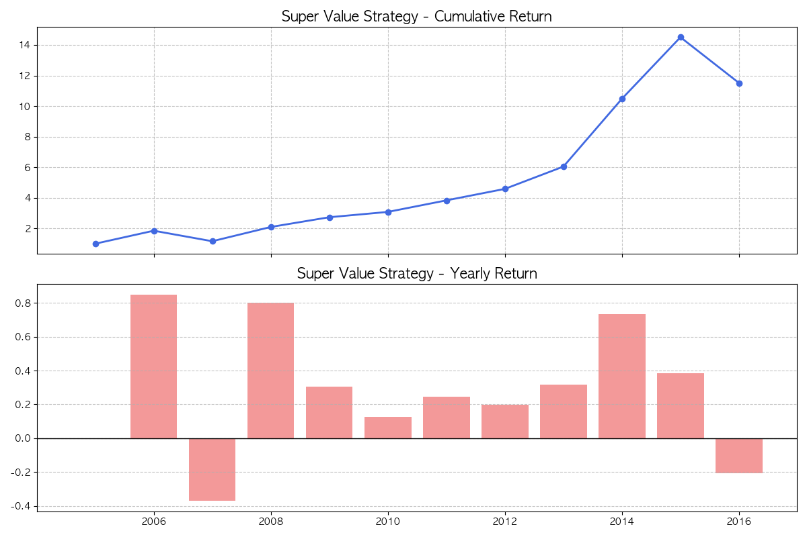

# Lec 1-6: 통합 프로젝트 - 재무제표 기반 퀀트 백테스팅

이 장에서는 앞서 배운 NumPy와 Pandas의 기능을 총동원하여 실제 재무제표 데이터를 활용한 퀀트 투자 전략을 구현하고 백테스팅하는 실전 프로젝트를 진행합니다.

## 1. 데이터 로드 및 전처리

백테스팅을 위해 데이터를 정제하고, 연간 수익률 테이블을 생성합니다. 퀀트 백테스팅의 첫 단추는 **시점(Look-ahead Bias)**을 맞추는 것입니다.

```python
import pandas as pd
import numpy as np

# 1. 데이터 로드 및 컬럼명 정리
df = pd.read_csv("미래에셋자산운용/sample_project/my_data/fin_statement_new.csv")
df = df.drop(["상장일"], axis=1)
df = df.rename(columns={
    "DPS(보통주, 현금+주식, 연간)": "DPS",
    "P/E(Adj., FY End)": "PER",
    "P/B(Adj., FY End)": "PBR",
    "P/S(Adj., FY End)": "PSR",
})

# 2. 연간 가격 테이블 생성 (Pivot)
# 각 종목의 연말 주가를 가로로 나열하여 연도별 변동을 쉽게 계산하도록 합니다.
yearly_price_df = df.pivot(index="year", columns="Name", values="수정주가")

# 3. 연간 수익률 계산
# shift(-1)을 통해 'X년도 말 지표로 매수 시 1년 뒤 수익률'로 정렬합니다.
# 이는 '데이터 확인 시점'과 '실제 수익 발생 시점'을 일치시키기 위함입니다.
yearly_rtn_df = yearly_price_df.pct_change(fill_method=None).shift(-1)

print(f"수익률 테이블 크기: {yearly_rtn_df.shape}")
# 출력: 수익률 테이블 크기: (12, 2241)
```

---

## 2. 퀀트 전략 백테스팅 엔진 구현

### 2.1. 단일 지표 전략 (예: ROA 상위 10개)
특정 지표가 우수한 종목들을 매년 선정하여 포트폴리오를 구성하고 수익률을 계산합니다.

```python
indicator = "ROA"
top_n = 10

# 매년 ROA 상위 10개 종목 인덱스 추출
top_n_idx = df.groupby(['year'])[indicator].nlargest(top_n).reset_index()
top_n_roa_df = df.loc[top_n_idx['level_1']]

# 종목 선택 마스크 생성 (선택된 종목은 1, 아니면 NaN)
indicator_df = top_n_roa_df.pivot(index="year", columns="Name", values="ROA")
asset_on_df = indicator_df.notna().astype(int).replace(0, np.nan)

# 포트폴리오 수익률 계산 (동일가중)
selected_return_df = yearly_rtn_df * asset_on_df
rtn_series = selected_return_df.mean(axis=1)

# 누적 수익률 계산
rtn_series.loc[2005] = 0 # 시작점 설정
rtn_series = rtn_series.sort_index()
cum_rtn_series = (rtn_series + 1).cumprod().dropna()

print(f"최종 누적 수익률: {cum_rtn_series.iloc[-1]:.3f}")
# 출력: 최종 누적 수익률: 0.842
```



> **분석**: 단순히 ROA가 높은 종목만 골랐을 때 누적 수익률이 오히려 1보다 낮아지는 구간이 발생합니다. 이는 고ROA 종목이 이미 고평가되어 있을 가능성을 시사합니다.

---

## 3. 실전 전략 구현 (소형주 + 저PBR)

강환국 저자의 '할수있다 퀀트투자'에 소개된 가장 강력한 전략 중 하나를 구현합니다.

```python
# 1. Filter: 소형주 (시가총액 하위 20%)
# 시장의 관심이 적고 상승 여력이 큰 종목들을 유니버스로 제한합니다.
market_cap_20 = df.groupby("year")['시가총액'].quantile(.2)
filtered_df = df.join(market_cap_20, on="year", how="left", rsuffix="_q20")
filtered_df = filtered_df[filtered_df['시가총액'] <= filtered_df['시가총액_q20']]

# 2. Selector: 저PBR (0.2 이상 중 가장 낮은 15개)
# 자산 가치 대비 저평가된 종목을 선택하되, 상장폐지 위험이 있는 초저PBR(0.2 미만)은 제외합니다.
filtered_df = filtered_df[filtered_df['PBR'] >= 0.2]
smallest_pbr = filtered_df.groupby("year")['PBR'].nsmallest(15)
selected_index = smallest_pbr.index.get_level_values(1)

# 3. 수익률 계산
selector_df = filtered_df.loc[selected_index].pivot(index='year', columns="Name", values="PBR")
asset_on_df = selector_df.notna().astype(int).replace(0, np.nan)
rtn_series = (yearly_rtn_df * asset_on_df).mean(axis=1)
rtn_series.loc[2005] = 0
cum_rtn_series = (rtn_series.sort_index() + 1).cumprod().dropna()

print(f"전략 최종 누적 수익률: {cum_rtn_series.iloc[-1]:.3f}")
# 출력: 전략 최종 누적 수익률: 4.578
```



> **분석**: ROA 전략과 달리 압도적인 누적 수익률을 보여줍니다. 소형주 효과와 가치 지표(PBR)의 결합이 한국 시장에서 얼마나 강력한지 알 수 있습니다.

---

## 4. 복합 전략의 확장

### 4.1. 그레이엄 업그레이드 전략 (ROA + 부채비율 + 저PBR)
재무 건전성(부채비율)과 수익성(ROA)을 필터로 사용하고 저PBR로 종목을 선정합니다.



### 4.2. 슈퍼가치 전략 (PBR + PER + PSR 통합 순위)
여러 가치 지표의 순위를 합산하여 종합적으로 저평가된 종목을 선정합니다.



---

## 5. 학습 포인트 (퀀트 투자 관점)

1.  **Look-ahead Bias (미래 참조 편향)**: 백테스팅 시점에 알 수 없는 미래 데이터를 사용하여 수익률을 계산하지 않도록 주의해야 합니다. `shift()` 함수를 사용하여 데이터 시점을 정확히 맞추는 것이 중요합니다.
2.  **Filter vs Selector**: 
    *   **Filter**: 유니버스(투자 대상)를 제한하는 조건 (예: 소형주, 특정 부채비율 이하).
    *   **Selector**: 필터링된 유니버스 내에서 순위를 매겨 실제 매수 종목을 고르는 지표 (예: 낮은 PBR 순).
3.  **데이터 무결성**: 상장 폐지 종목의 수익률 처리, 결측치(NaN)에 대한 페널티 부여(순위 하위권 배치 등)는 백테스팅의 신뢰도를 결정하는 핵심 요소입니다.

---

## 5. 주요 라이브러리 함수 정리

| 라이브러리 | 클래스/모듈 | 함수명 | 설명 |
| :--- | :--- | :--- | :--- |
| **Pandas** | `DataFrame` | `pivot()` | Long-form 데이터를 Wide-form(행렬)으로 변환 |
| **Pandas** | `Series/DataFrame` | `pct_change()` | 이전 요소 대비 변화율(수익률) 계산 |
| **Pandas** | `Series/DataFrame` | `shift()` | 데이터를 특정 간격만큼 이동 (시점 조정에 활용) |
| **Pandas** | `DataFrame` | `nlargest() / nsmallest()` | 특정 컬럼의 값이 가장 큰/작은 n개의 행 추출 |
| **Pandas** | `Series/DataFrame` | `cumprod()` | 누적 곱 계산 (누적 수익률 계산에 필수) |
| **Pandas** | `Series/DataFrame` | `rank()` | 데이터의 순위를 매김 |
| **Pandas** | `Series/DataFrame` | `replace()` | 특정 값을 다른 값으로 변경 |
| **Pandas** | `Index` | `get_level_values()` | 멀티인덱스의 특정 레벨 값을 추출 |
| **Apache** | `Parquet` | `-` | 대규모 데이터 처리를 위한 컬럼 기반 저장 형식 (S3 최적화) |
