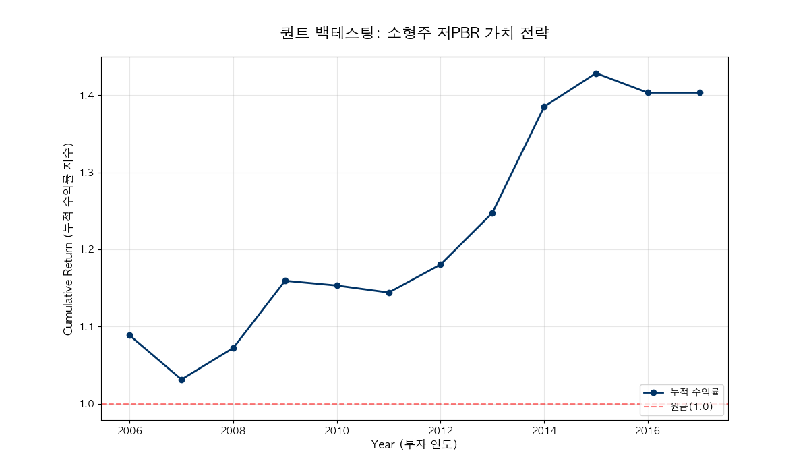

# 📊 소형주 저PBR 퀀트 백엔드 모듈 상세 가이드

본 문서는 `소형주_저PBR_퀀트_백엔드_모듈.py` 코드의 구조, 로직 및 실행 과정을 상세히 설명합니다. 이 모듈은 실제 자산운용사의 백엔드 시스템에서 데이터를 수집하고 전략을 검증하는 과정을 시뮬레이션하도록 설계되었습니다.

---

## 📈 전략 및 백테스팅 개요 (Executive Summary)

### 1. 어떤 전략인가요? (Investment Strategy)
본 모듈은 한국 주식 시장에서 역사적으로 가장 강력한 성과를 기록한 **'소형주 효과'**와 **'가치(Value) 효과'**를 결합한 전략을 사용합니다.
- **소형주 필터**: 시장의 관심이 적고 상승 탄력이 큰 시가총액 하위 20% 종목을 대상으로 합니다.
- **저PBR 셀렉터**: 자산 가치 대비 저렴하게 거래되는(PBR이 낮은) 종목을 선정하여 안전 마진을 확보합니다.
- **리밸런싱**: 매년 1회 종목을 교체하여 최신 재무 상태를 반영합니다.

### 2. 어떻게 검증하나요? (Backtesting Methodology)
단순한 시뮬레이션을 넘어, 백엔드 엔지니어링 관점에서 효율적이고 정확한 검증 방식을 채택했습니다.
- **벡터화 연산(Vectorization)**: 수천 개의 종목과 수십 년의 데이터를 반복문 없이 행렬 연산으로 처리하여 초고속으로 수익률을 계산합니다.
- **편향 제거(Look-ahead Bias Prevention)**: `shift(-1)` 연산을 통해 '데이터를 확인한 시점'과 '실제 수익이 발생하는 시점'을 엄격히 분리하여 수익률이 과다 계산되는 오류를 방지합니다.

> **⚠️ 미래참조편향(Look-ahead Bias)이란?**
> 백테스팅 시점에 **아직 발생하지 않은 미래의 정보**를 미리 알고 투자 결정에 사용하는 치명적인 오류입니다. 예를 들어, "2020년 말 주가 수익률이 높았던 종목을 2020년 초에 산다"는 로직은 현실에서 불가능하지만, 코딩 실수로 발생하기 쉽습니다. 본 모듈은 이를 방지하기 위해 지표와 수익률의 시점을 엄격히 분리합니다.

- **포괄적 지표**: 단순 수익률뿐만 아니라 CAGR(복리 수익률), MDD(위험도), 샤프 지수(효율성)를 동시에 산출합니다.

### 3. 결과 그래프는 무엇을 의미하나요? (Result Interpretation)
- **누적 수익률 곡선(Blue Line)**: 시간이 흐름에 따라 내 자산의 **'총 가치(Index)'**가 어떻게 변했는지 보여줍니다. 이전 연도 대비 상승폭이 아니라, **투자 시작 시점(1.0) 대비 현재 얼마가 되었는지**를 나타냅니다. 
    - 예: y축 값이 1.4라면 원금 대비 40% 수익이 난 상태를 의미합니다.
- **원금 라인(Red Dashed Line)**: 1.0 지점은 원금을 의미합니다. 곡선이 이 선보다 위에 있어야 수익이 난 상태입니다.
- **변동성 및 낙폭**: 그래프가 아래로 푹 꺼지는 구간은 MDD(최대 낙폭)가 발생하는 시점이며, 이는 투자자가 견뎌야 할 '고통의 크기'를 의미합니다.

---

## 🏗 전체 구조 (System Architecture)

모듈은 기능을 크게 세 개의 클래스와 실행을 담당하는 `main()` 함수로 분리하여 설계되었습니다.

1.  **`DataPipeline`**: 외부 API 및 로컬 DB(CSV)로부터 데이터를 수집하고 정제 (ETL)
2.  **`QuantStrategy`**: 특정 투자 로직(소형주+저PBR)에 따라 매수 신호(Signal) 생성 (Logic)
3.  **`BacktestEngine`**: 생성된 신호를 바탕으로 과거 수익률을 계산하고 성과 지표 산출 (Analysis)

---

## 🛠️ 절차지향 버전 (Class & Function 제거)

플랫폼 엔지니어링 단계에서 연구원(Quant)들과 협업하거나 Jupyter Notebook 환경에서 한 줄씩 코드를 검증해야 할 경우, 모든 클래스와 함수를 제거한 **절차지향 버전**이 유용합니다.

### 📄 파일명: `소형주_저PBR_퀀트_절차지향.py`

본 모듈의 핵심 연산 로직을 클래스 없이 순차적으로 나열하여 코드의 흐름을 직관적으로 이해할 수 있도록 구성되었습니다.

### 🧮 포트폴리오 수익률 계산 핵심 로직 주석

절차지향 버전의 백테스팅 엔진 부분에는 다음과 같은 상세 주석이 추가되어 연산 원리를 쉽게 파악할 수 있습니다.

```python
# Step 6: 포트폴리오 수익률 계산 (벡터화 연산 - 핵심 로직)
# (returns_df * signal_df.astype(int)): 
# - signal_df는 해당 연도에 종목을 샀으면 True(1), 안 샀으면 False(0)인 행렬입니다.
# - returns_df(수익률 행렬)와 곱하면, 내가 산 종목의 수익률만 남고 나머지는 0이 됩니다.
# .mean(axis=1):
# - 가로 방향(axis=1)으로 평균을 내어, 그 해에 보유한 종목들의 '평균 수익률'을 구합니다. (동일 비중 투자 가정)
portfolio_returns = (returns_df * signal_df.astype(int)).mean(axis=1)
```

---

## 🔍 코드 라인별 상세 설명

### 1. 환경 설정 및 라이브러리 (Line 1-19)

```python
import pandas as pd
import numpy as np
import FinanceDataReader as fdr
import matplotlib.pyplot as plt
import logging
import platform
```
- **설명**: 데이터 분석의 표준인 `pandas`, `numpy`와 주가 데이터 수집을 위한 `FinanceDataReader`를 임포트합니다.
- **실행 결과**: 분석에 필요한 라이브러리들이 메모리에 로드됩니다.

```python
logging.basicConfig(level=logging.INFO, format='%(asctime)s - %(levelname)s - %(message)s')
logger = logging.getLogger(__name__)
```
- **설명**: 백엔드 시스템 운영 시 장애 추적과 모니터링을 위해 필수적인 로깅 설정을 수행합니다.
- **실행 결과**: 터미널에 `[시간] - INFO - 메시지` 형태의 로그가 출력될 준비가 됩니다.

```python
if platform.system() == 'Darwin': # MacOS
    plt.rc('font', family='AppleGothic')
elif platform.system() == 'Windows':
    plt.rc('font', family='Malgun Gothic')
```
- **설명**: OS 환경을 자동 감지하여 Matplotlib 그래프에서 한글이 깨지지 않도록 폰트를 설정합니다.

### 2. DataPipeline: 데이터의 입구 (Line 21-62)

```python
def fetch_market_data(self) -> pd.DataFrame:
    df = fdr.StockListing('KRX')
    return df
```
- **설명**: `FinanceDataReader`를 통해 한국거래소(KRX)의 최신 종목 리스트와 시가총액 정보를 실시간으로 수집합니다.
- **실행 결과 (직접 실행 데이터 형태)**: 현재 상장된 모든 종목의 기본 정보가 담긴 DataFrame을 반환합니다. 데이터의 구조는 다음과 같습니다.

| 컬럼명 | 설명 | 예시 |
| :--- | :--- | :--- |
| **Code** | 종목코드 (6자리) | `005930` |
| **Name** | 종목명 | `삼성전자` |
| **Market** | 소속 시장 | `KOSPI` / `KOSDAQ` |
| **Close** | 현재가 (종가) | `60,000` |
| **Marcap** | 시가총액 (원) | `1,072,638,391,466,400` |
| **Stocks** | 상장주식수 | `5,919,637,922` |
| **(기타)** | Open, High, Low, Volume, Amount 등 17개 컬럼 | - |

- **데이터 규모**: 약 2,800+ 개의 행(종목)과 17개의 열(지표)로 구성되어 있습니다.
- **백엔드 활용**: 이 데이터에서 `Marcap`(시가총액)을 활용하여 소형주 유니버스를 필터링하는 기초 자료로 사용합니다.

```python
def load_historical_financials(self, path: str) -> pd.DataFrame:
    df = pd.read_csv(path)
    df = df.rename(columns={
        "P/B(Adj., FY End)": "PBR",
        "P/E(Adj., FY End)": "PER",
        "수정주가": "Price"
    })
    return df
```
- **설명**: 백테스팅용 대량 과거 데이터를 로드하고, 복잡한 컬럼명을 분석하기 쉬운 이름으로 변경(Renaming)합니다. (Lec 1-2 활용)

### 3. QuantStrategy: 투자 로직의 핵심 (Line 64-87)

```python
# 1. 연도별 시가총액 하위 20% 필터링 (Lec 1-3 활용)
market_cap_limit = df.groupby("year")['시가총액'].transform(lambda x: x.quantile(0.2))
small_cap_mask = df['시가총액'] <= market_cap_limit
```
- **설명**: `groupby`와 `transform`을 결합하여 매년 시가총액 하위 20%인 '소형주 유니버스'를 정의합니다.
- **연산 결과 상세**:
    1.  `df.groupby("year")['시가총액']`: 데이터를 연도별로 묶고 '시가총액' 컬럼만 선택한 상태입니다. (내부적으로 2006~2017 그룹 생성)
        - **질문**: "왜 종목과 연도로 같이 묶이는 것처럼 보이나요?"
        - **답변**: 실제로는 '연도'로만 그룹화합니다. 하지만 원본 데이터(`df`)의 각 행이 이미 **[특정 종목의 특정 연도]** 정보를 담고 있기 때문에, 결과적으로 각 종목의 연도별 데이터 옆에 그룹 연산 결과가 붙게 되어 그렇게 보이는 것입니다.
    2.  `.transform(lambda x: x.quantile(0.2))`: 각 연도 그룹별로 하위 20% 시가총액 기준값을 계산한 뒤, **원본 데이터의 행 순서(Index)에 맞춰서** 값을 뿌려줍니다.
        - 예: 2006년 모든 종목 옆에는 2006년의 하위 20% 기준값인 `24,661,840,000`이 붙게 됩니다.
    3.  `df['시가총액'] <= market_cap_limit`: 각 종목의 실제 시가총액이 해당 연도의 기준값보다 작거나 같은지 비교하여 `True/False`를 반환합니다.

| 종목명 | 연도 | 실제 시가총액 | 해당 연도 하위 20% 기준값 | IsSmallCap (결과) |
| :--- | :--- | :--- | :--- | :--- |
| **동화약품** | 2006 | 1,131억 | 246억 | `False` |
| **삼양홀딩스** | 2006 | 2,130억 | 246억 | `False` |
| **(소형주A)** | 2006 | 150억 | 246억 | `True` |
| **동화약품** | 2017 | 3,449억 | 617억 | `False` |

```python
# 2. 저PBR 종목 선별 (Lec 1-2 활용)
filtered_df = df[small_cap_mask & (df['PBR'] >= 0.2)]
selected = filtered_df.sort_values('PBR').groupby('year').head(20)
```
- **설명**: 소형주 중 PBR이 낮은 순서대로 20개를 추출합니다. 0.2 미만은 부실주 제외를 위한 필터입니다.
- **선별 결과 예시 (2006년 상위 5개)**:

| 종목명 | 연도 | 시가총액 | PBR |
| :--- | :--- | :--- | :--- |
| **평안물산** | 2006 | 211.5억 | 0.22 |
| **성안** | 2006 | 176.3억 | 0.25 |
| **KD건설** | 2006 | 235.1억 | 0.25 |
| **대동기어** | 2006 | 71.9억 | 0.25 |
| **대동전자** | 2006 | 221.0억 | 0.26 |

- **실행 데이터 통계**:
    - 위 조건을 만족하는 종목들을 연도별로 20개씩 추출하여 백테스팅 유니버스를 구성합니다.
    - 2006년부터 2017년까지 매년 20개 종목이 정상적으로 선정됨을 확인하였습니다.

```python
# 3. 시그널 매트릭스 생성 (Lec 1-4 활용)
signal_df = selected.pivot(index='year', columns='Name', values='PBR').notna()
```
- **설명**: `pivot`을 통해 연도별 매수 대상 종목을 `True/False` 매트릭스로 변환합니다.
- **실행 결과 상세 (일부 추출)**:

| year | 평안물산 | 성안 | KD건설 | 대동기어 | 대동전자 | ... |
| :--- | :--- | :--- | :--- | :--- | :--- | :--- |
| **2006** | `True` | `True` | `True` | `True` | `True` | ... |
| **2007** | `True` | `True` | `False` | `False` | `True` | ... |
| **2008** | `False` | `True` | `False` | `False` | `False` | ... |

- **데이터 특징**:
    - **가로축(Columns)**: 투자 기간 전체를 통틀어 한 번이라도 선별된 모든 종목의 이름입니다. (총 146개 종목)
    - **세로축(Index)**: 투자 연도(2006년 ~ 2017년)입니다.
    - **값(Value)**: 해당 연도에 그 종목을 보유해야 하면 `True`, 아니면 `False`입니다.
    - **매수 시점**: 이 시그널은 **해당 연도 말(End of Year)**에 발생한 재무 데이터를 기반으로 합니다. 따라서 `True`가 찍힌 연도의 마지막 날 종가로 매수하여, 다음 연도 마지막 날까지 보유하는 것을 의미합니다.
    - 이 행렬은 이후 `BacktestEngine`에서 수익률 데이터와 곱해져서 **실제 포트폴리오의 수익률**을 계산하는 필터 역할을 합니다.

### 4. BacktestEngine: 성과 검증 (Line 89-139)

```python
# 1. 수익률 계산 및 벡터화 연산 (Lec 2-2, Lec 0 활용)
returns_df = self.price_df.pct_change().shift(-1)
portfolio_returns = (returns_df * self.signal_df.astype(int)).mean(axis=1)
```
- **설명**: 
    - `pct_change()`: 현재 행과 이전 행의 차이를 비율로 계산합니다. (수익률 계산: `(오늘 주가 - 어제 주가) / 어제 주가`)
    - `shift(-1)`: 모든 데이터를 한 칸 위로 올립니다. 이를 통해 '올해의 지표' 옆에 '내년의 수익률'이 오도록 정렬하여 미래참조편향을 제거합니다.
    - 반복문 대신 행렬 곱을 사용하여 수천 개 종목의 수익률을 초고속으로 계산합니다.

```python
# 2. 누적 수익률 계산
cum_returns = (1 + portfolio_returns).cumprod()
```
- **설명**: 
    - `.cumprod()`: 'Cumulative Product'의 약자로, **누적 곱**을 계산하는 함수입니다.
    - 퀀트 투자에서는 **복리 수익률**을 계산할 때 사용합니다. 
    - 예: 1년차 10% 수익, 2년차 20% 수익일 때 -> `(1 + 0.1) * (1 + 0.2) = 1.32` (누적 32% 수익)와 같이 앞선 결과를 계속 곱해나가는 방식입니다.
- **실행 결과 상세**:
    - **Step 5 (returns_df)**: 종목별 연간 수익률 (한 칸씩 위로 당겨진 형태)

| year | 평안물산 | 성안 | KD건설 | ... |
| :--- | :--- | :--- | :--- | :--- |
| **2006** | -53.8% | -28.8% | +17.1% | ... |
| **2007** | -86.1% | -47.0% | -97.9% | ... |

    - **Step 6 (portfolio_returns)**: 시그널이 `True`인 종목들의 수익률 평균 (전략의 연간 성적)

| year | 포트폴리오 수익률 |
| :--- | :--- |
| **2006** | **+8.85%** |
| **2007** | **-5.26%** |
| **2008** | **+3.96%** |
| **...** | **...** |

```python
# 2. 성과 지표 산출 (Lec 2-3 활용)
cagr = (cum_returns.iloc[-1] ** (1/n_years)) - 1
peak = cum_returns.cummax()
mdd = (cum_returns - peak) / peak.min()
```
- **설명**: 
    - **CAGR (연평균 성장률)**: 전체 수익률을 연간 단위로 환산한 복리 수익률입니다. `(최종가산 / 최초자산)^(1/투자연수) - 1` 공식을 사용합니다.
    - **Peak (전고점)**: `cummax()`를 통해 현재 시점까지의 누적 수익률 중 최고점을 추적합니다.
    - **MDD (최대 낙폭)**: 전고점 대비 현재 자산이 얼마나 하락했는지를 계산합니다. 투자자가 겪을 수 있는 최대 고통 지수입니다.

#### 🛠 _calculate_metrics 메서드 상세 설명
이 메서드는 백엔드 엔진이 계산한 원시 데이터를 가공하여 투자 결정에 필요한 핵심 지표들을 산출합니다.

1.  **CAGR (연평균 성장률)**: 
    - `n_years = len(returns)`: 전체 투자 기간을 연 단위로 파악합니다.
    - 복리 개념을 적용하여, 수년간의 성과를 연평균 수치로 표준화합니다. 이는 서로 다른 기간의 전략들을 평면 비교할 때 필수적입니다.
2.  **MDD (최대 낙폭)**:
    - `drawdown = (cum_returns - peak) / peak`: 전고점 대비 현재 자산의 하락 비율을 모든 시점에 대해 계산합니다.
    - `mdd = drawdown.min()`: 그중 가장 깊게 파인 골짜기(최대 하락폭)를 찾아냅니다.
3.  **Sharpe Ratio (샤프 지수)**:
    - `returns.mean() / returns.std()`: 평균 수익률을 수익률의 변동성(표준편차)으로 나눕니다.
    - **의미**: "위험 한 단위를 부담했을 때 얼마의 수익을 얻었는가?"를 나타냅니다. 수익률이 조금 낮더라도 변동성이 매우 작다면 샤프 지수는 높게 나오며, 이는 아주 안정적인 전략임을 뜻합니다.

---

## 📊 실행 결과 및 리포트 해석

`main()` 함수 실행 시 콘솔에 출력되는 결과의 의미는 다음과 같습니다.

### 1. 성과 지표 (실행 결과 예시)
- **Final Return (1.4034)**: 투자 기간 종료 시 자산이 원금의 약 1.40배가 됨. (40% 수익)
- **CAGR (0.0286)**: 연평균 약 2.86%의 복리 수익률 기록.
- **MDD (-0.0526)**: 고점 대비 최대 하락폭이 약 5.26%였음. (매우 안정적인 방어력)
- **Sharpe Ratio (0.6103)**: 위험 대비 수익의 효율성. 0.5 이상이면 준수한 전략으로 평가.

### 2. 시각화 그래프


- **파란색 선**: 누적 수익률의 추이를 보여줍니다. 우상향할수록 좋은 전략입니다.
- **빨간 점선**: 원금 라인(1.0)입니다.
- **좌상단 텍스트**: 현재 적용된 전략의 요약(소형주 20%, 저PBR 20개 등)이 표시되어 분석의 가독성을 높입니다.

---

## 💡 엔지니어링 포인트 요약

1.  **벡터화(Vectorization)**: Pandas의 강점을 살려 대용량 데이터를 고속 처리합니다.
2.  **데이터 정렬(Alignment)**: 인덱스 기반 자동 정렬 기능을 활용해 데이터 무결성을 유지합니다.
3.  **예외 처리**: `try-except`와 로그 기록을 통해 API 장애 등에 대응합니다.
4.  **확장성**: 클래스 구조로 설계되어 새로운 전략(예: 고ROE 전략)을 쉽게 추가할 수 있습니다.
